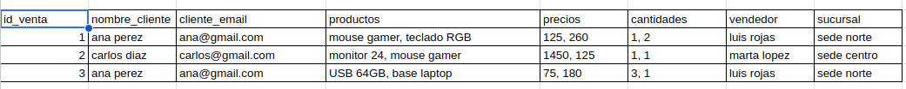
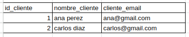
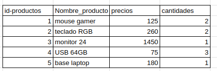
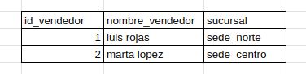
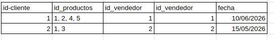

# Gestion de ventas
 Normalizacion de ventas Campus

# Razonamiento del problema
    ```
        La empesa tiene estos problemas:


        Este diseno genera problemas:

        - Datos duplicados.
        - Dificultad para actualizar informacion sin inconsistencias.
        - Eliminaciones que pueden borrar informacion importante.
        - Campos con multiples valores en una misma celda.
        - Reportes lentos o dificiles de escribir.

        El objetivo es reducier estos problemas, brindandole una base de datos que me mantenga los registros de las ventas que se realizan.

    ```
# Datos recaudados (referencia)
## Forma uno.
- Aqui registramos todos los datos que se recopilan de las ventas:

  

## forma dos

- En esta parte separamos los diferentes campos que estan registrados (cliente, producto, vendedor).
  




## forma tres

- unificamos los datos y quitamos los duplicados.
 