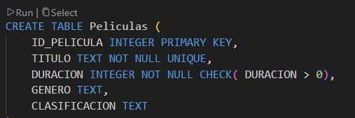
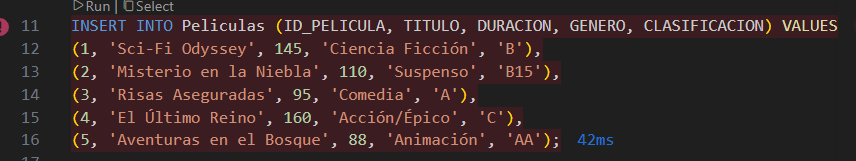
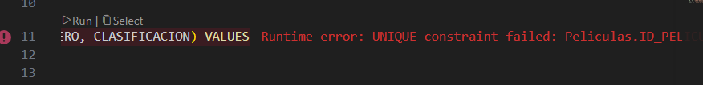

#  Proyecto:Sistema de Gestión de Base de Datos - CineMax 🎬

## Información del camper

* **Nombre del Camper:** Lester Garcia
* **Grupo / Ruta:** Team U1
* **Fecha que entrego el proyecto:** [ 07/ 06 / 2026]

---

## Descripción del Problema

### ¿Qué necesidad tiene la empresa CineMax?
La empresa **CineMax** se enfrenta a serios inconvenientes operativos debido a que el registro de sus operaciones clave se realiza de forma manual. Esta falta de automatización y centralización provoca un vacío de información estratégica en tiempo real, lo que dificulta:

* 📊 **Consultar cuántas funciones existen:** 

* 🎥 **Saber qué películas se proyectan:** 

* 🎟️ **Conocer cuántos boletos se han vendido:** 

* 💺 **Identificar cuáles son las salas más utilizadas:** 

### ¿Cómo la base de datos propuesta ayuda a resolverla?
La base de datos relacional desarrollada (basada en el SGBD SQLite) soluciona de raíz estas problemáticas mediante el almacenamiento organizado, consistente y consultable de la información. 

El sistema aporta valor a través de los siguientes pilares:
1. **Centralización y Consistencia:** Organiza la información en entidades independientes interconectadas (Películas, Salas, Funciones y Boletos), eliminando la redundancia y garantizando que los datos no se dupliquen.
2. **Escalabilidad y Auditoría:** Al contar con restricciones de tipo (`NOT NULL`, `CHECK`, llaves primarias y foráneas), el negocio asegura que cada boleto vendido pertenezca estrictamente a una función existente, evitando errores humanos de facturación o sobreventa de asientos.

## Modelo de datos.

1.Este es el diagrama UML con el que se comenzo para realizar la base de datos.

.png)

2.Las entidades encontradas fueron:Peliculas, salas de proyeccion, funciones y boletos, esto debido a que solo se necesitaba la informacion organizada en 4 tablas.

3.Las relaciones se encontraron de la siguiente manera:
  ** Muchos boletos tienen una funcion.
  ** Una pelicula tiene muchas funciones.
  ** Una sala tiene muchas funciones.

## Evidencia
1. Restricciones

2. Inserciones.

3. Run time error:

