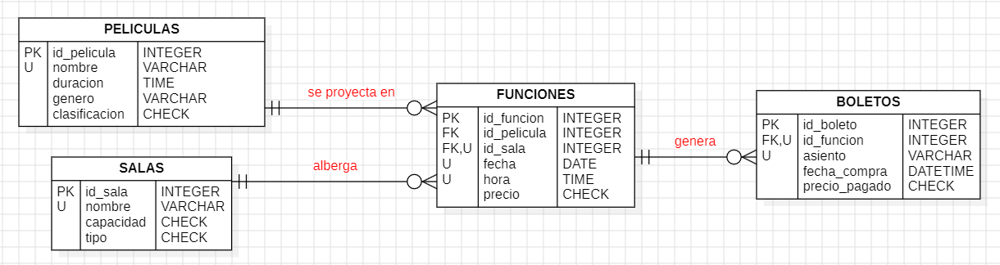

# CineMax - Base de Datos con SQLite

## 1. Informacion General

- **Nombre del proyecto:** Base de datos CineMax con SQLite
- **Nombre del camper:** Maria Montepeque
- **Grupo o ruta:** _(completar)_
- **Fecha de entrega:** _(completar)_

## 2. Descripcion del Problema

La empresa **CineMax** registra manualmente la informacion de sus peliculas,
salas, funciones y boletos, lo que le dificulta consultar cuantas funciones
existen, que peliculas se proyectan, cuantos boletos se han vendido y cuales
son las salas mas utilizadas.

La base de datos propuesta organiza esa informacion en cuatro tablas
relacionadas, con restricciones de integridad que evitan datos duplicados o
invalidos. Asi la empresa puede consultar todo de forma rapida y confiable
mediante sentencias SQL, en lugar de revisar registros manuales.

## 3. Modelo de Datos



### Entidades

- **peliculas:** catalogo de peliculas, con su duracion, genero y clasificacion.
- **salas:** salas fisicas de proyeccion, con su capacidad y tipo (2D, 3D, IMAX, 4DX).
- **funciones:** proyeccion de una pelicula en una sala, en una fecha y hora, con su precio.
- **boletos:** boletos vendidos para una funcion, indicando el asiento y la compra.

### Relaciones

- Una **pelicula** puede tener muchas **funciones** (1:N).
- Una **sala** puede albergar muchas **funciones** (1:N).
- Una **funcion** puede generar muchos **boletos** (1:N).

La tabla `funciones` actua como la relacion entre `peliculas` y `salas`,
ya que cada funcion necesita una pelicula y una sala. La tabla `boletos`
depende de `funciones`.

## 4. Restricciones Implementadas

### Llaves primarias (PRIMARY KEY)
- `peliculas.id_pelicula`, `salas.id_sala`, `funciones.id_funcion`, `boletos.id_boleto`.

### Llaves foraneas (FOREIGN KEY)
- `funciones.id_pelicula` → `peliculas.id_pelicula`
- `funciones.id_sala` → `salas.id_sala`
- `boletos.id_funcion` → `funciones.id_funcion`

### NOT NULL
- Todos los atributos obligatorios (nombre, duracion, fecha, hora, precio, asiento, etc.).

### UNIQUE
- `peliculas.nombre` y `salas.nombre` (no se repiten).
- `funciones (id_sala, fecha, hora)`: una sala no tiene dos funciones simultaneas.
- `boletos (id_funcion, asiento)`: un asiento no se vende dos veces en la misma funcion.

### CHECK
- `peliculas.duracion > 0`
- `peliculas.clasificacion IN ('TP', '+12', '+15', '+18')`
- `salas.capacidad > 0`
- `salas.tipo IN ('2D', '3D', 'IMAX', '4DX')`
- `funciones.precio > 0`
- `boletos.precio_pagado >= 0`

## 5. Evidencias

Las salidas de creacion de tablas, insercion de registros, ejecucion de
consultas y errores por restricciones se encuentran en las capturas adjuntas
a esta resolucion. Los datos de prueba cumplen los minimos solicitados:
5 peliculas, 5 salas, 8 funciones y 10 boletos.

## Como ejecutar

Desde esta carpeta:

```bash
sqlite3 cinemax.db < ddl/schema.sql
sqlite3 cinemax.db < dml/inserts.sql
sqlite3 cinemax.db < dql/consultas.sql
```

Para entrar a la consola interactiva:

```bash
sqlite3 cinemax.db
```

Comandos utiles dentro de SQLite:

```sql
.tables
.schema
.headers on
.mode column
```