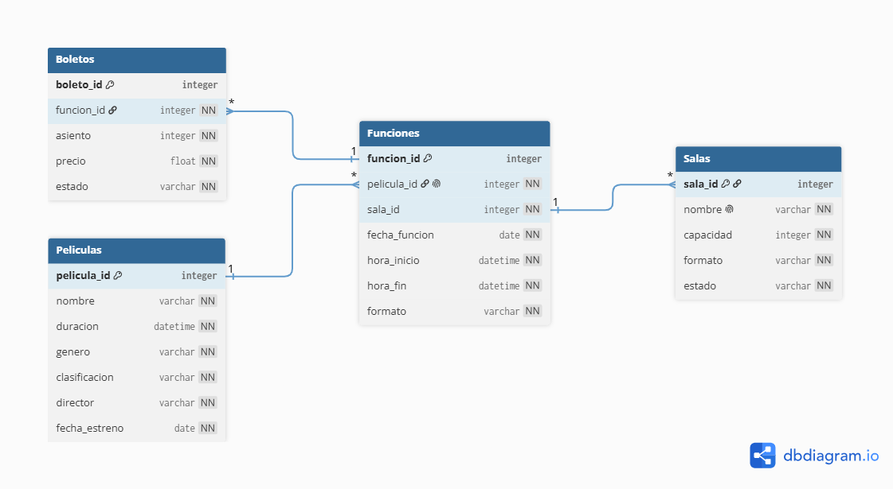

# CineMax - Sistema de Gestión de Cine

## 1. Información General

**Proyecto:** Base de Datos CineMax

**Camper:** Antonio Canux

**Fecha de entrega:** 2026/06/07

---

# 2. Descripción del Problema

## Situación

La empresa CineMax necesita una forma organizada de administrar la información relacionada con las películas que se proyectan, las salas disponibles, las funciones programadas y la venta de boletos.

Sin una base de datos estructurada, la gestión de esta información puede generar problemas como:

* Ducplicación de registros.
* Inconsistencias en la programación de funciones.
* Dificultad para controlar la disponibilidad de boletos.
* Errores en la asignación de salas y horarios.

## Solución Propuesta

Se desarrolló una base de datos relacional utilizando SQLite que permite:

* Registrar películas disponibles.
* Administrar las salas del cine.
* Programar funciones para cada película.
* Gestionar la venta y disponibilidad de boletos.

Además, se implementaron restricciones de integridad para garantizar la calidad y consistencia de los datos almacenados.

---

# 3. Modelo de Datos

## Diagrama UML E-R



## Entidades Identificadas

### Peliculas

Almacena la información de cada película disponible en el cine.

Atributos:

* pelicula_id
* nombre
* duracion
* genero
* clasificacion
* director
* fecha_estreno

### Salas

Representa las salas disponibles dentro del cine.

Atributos:

* sala_id
* nombre
* capacidad
* formato
* estado

### Funciones

Contiene la programación de las películas en las diferentes salas.

Atributos:

* funcion_id
* pelicula_id
* sala_id
* fecha_funcion
* hora_inicio
* hora_fin
* formato

### Boletos

Registra los boletos asociados a cada función.

Atributos:

* boleto_id
* funcion_id
* asiento
* precio
* estado

---

## Relaciones

### Películas → Funciones

Una película puede tener múltiples funciones programadas.

Relación:

```text
Peliculas (1) ---- (N) Funciones
```

### Salas → Funciones

Una sala puede albergar múltiples funciones.

Relación:

```text
Salas (1) ---- (N) Funciones
```

### Funciones → Boletos

Una función puede tener múltiples boletos asociados.

Relación:

```text
Funciones (1) ---- (N) Boletos
```

---

# 4. Restricciones Implementadas

## PRIMARY KEY

Se implementaron claves primarias para identificar de manera única cada registro:

* pelicula_id
* sala_id
* funcion_id
* boleto_id

---

## FOREIGN KEY

Se implementaron llaves foráneas para mantener la integridad referencial:

* Funciones.pelicula_id → Peliculas.pelicula_id
* Funciones.sala_id → Salas.sala_id
* Boletos.funcion_id → Funciones.funcion_id

---

## NOT NULL

Se aplicaron restricciones NOT NULL en todos los atributos obligatorios para evitar registros incompletos.

Ejemplos:

* nombre
* duracion
* capacidad
* precio
* estado

---

## UNIQUE

Se implementaron restricciones UNIQUE para evitar duplicidad de datos.

Ejemplos:

```sql
nombre TEXT NOT NULL UNIQUE
```

Evita nombres repetidos de salas.

```sql
UNIQUE(funcion_id, asiento)
```

Evita la venta duplicada del mismo asiento en una función.

---

## CHECK

Se implementaron validaciones para restringir valores permitidos.

Ejemplos:

### Capacidad de salas

```sql
CHECK (capacidad > 0)
```

### Precio de boletos

```sql
CHECK (precio >= 0)
```

### Estado de salas

```sql
CHECK (
    estado IN (
        'Activa',
        'Mantenimiento',
        'Inactiva'
    )
)
```

### Estado de boletos

```sql
CHECK (
    estado IN (
        'Disponible',
        'Reservado',
        'Vendido'
    )
)
```

---

# Cómo Ejecutar

Desde la carpeta principal del proyecto:

```bash
sqlite3 cinemax.db < ddl/schema.sql
sqlite3 cinemax.db < dml/inserts.sql
sqlite3 cinemax.db < dql/consultas.sql
```

Si necesita ingresar al modo interactivo de SQLite:

```bash
sqlite3 cinemax.db
```

## Comandos útiles

```sql
.tables
.schema
.headers on
.mode column
```

---

# Estructura del Proyecto

```text
.
├── ddl
│   └── schema.sql
│
├── dml
│   └── inserts.sql
│
├── dql
│   └── consultas.sql
│
├── diagramas
│   └── diagram-er.png
│
└── README.md
```
