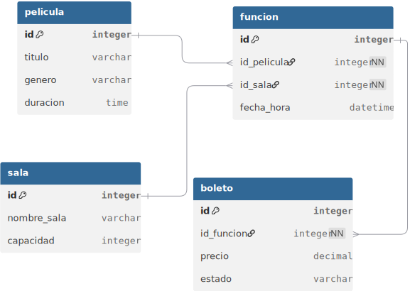

# cinemax
### problematica
_La empresa CineMax desea desarrollar un sistema sencillo para administrar la informacion relacionada con sus peliculas, salas de proyeccion, funciones y boletos vendidos._

_Actualmente la informacion se registra manualmente, lo que dificulta:_

_Consultar cuantas funciones existen.
Saber que peliculas se proyectan.
Conocer cuantos boletos se han vendido.
Identificar cuales son las salas mas utilizadas.
La empresa requiere una base de datos que permita almacenar esta informacion de forma organizada, consistente y consultable._

_Como analista de bases de datos, debe disenar el modelo de datos adecuado para resolver esta necesidad._

## funcionalidad
_Sistema diseñado para la gestión eficiente de tablas y el consumo optimizado de datos, mejorando tanto la estructura de la información como las relaciones entre entidades para consultas más eficaces._
### Entidades y Atributos

* **Entidades:**
1. Película
2. Sala
3. Boleto
4. Función

* **Atributos:**
1. **Película:**
* `id` (Identificador único / PK)
* `titulo`
* `genero`
* `duracion`
* `clasificacion`

2. **Sala:**
* `id` (Identificador único / PK)
* `nombre_sala`
* `tipo_sala`
* `capacidad`

3. **Boleto:**
* `id` (Identificador único / PK)
* `id_funcion` (Llave foránea / FK)
* `numero_asiento`
* `precio`
* `estado`

4. **Función:**
* `id` (Identificador único / PK)
* `id_pelicula` (Llave foránea / FK)
* `id_sala` (Llave foránea / FK)
* `fecha_hora`
* `estado`

## Relacion de entidades

### 1. Relación: Película → Función (Uno a Muchos)

* **Tipo:** Una película puede tener múltiples funciones (en diferentes horarios o días), pero cada función está asociada a una única película.
* **Implementación:** Se logra mediante la columna `id_pelicula` en la tabla `funcion`, que actúa como **Llave Foránea (FK)**.
* **Lógica:** Es la base para poder programar la cartelera.

### 2. Relación: Sala → Función (Uno a Muchos)

* **Tipo:** Una sala puede albergar muchas funciones a lo largo del tiempo, pero cada función específica ocurre en una única sala.
* **Implementación:** La columna `id_sala` en la tabla `funcion` conecta estas dos entidades.
* **Lógica:** Permite gestionar el uso de los espacios físicos y conocer la capacidad disponible para cada evento.

### 3. Relación: Función → Boleto (Uno a Muchos)

* **Tipo:** Una función puede tener muchos boletos vendidos (dependiendo de la capacidad de la sala), pero un boleto específico pertenece únicamente a una función.
* **Implementación:** La columna `id_funcion` en la tabla `boleto` enlaza cada ticket con su respectivo evento.
* **Lógica:** Es vital para el control de inventario de asientos y la recaudación económica.

---

## representacion visual

## Gestión de consultas
Las consultas implementadas permiten manipular los datos de manera estructurada. Mediante el uso de restricciones y condiciones, se asegura la coherencia de la información y se mejora significativamente la eficiencia en la administración de la base de datos.

**Realizado por:** _carlos elias tzoy velasco_