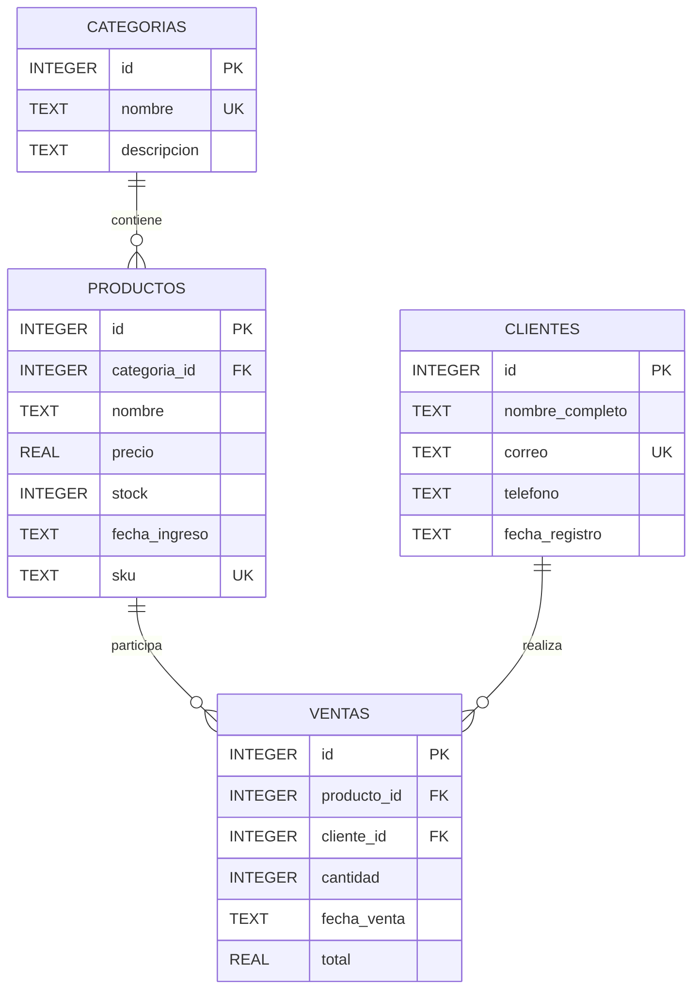

# Ejercicio 02: Campus Shop

**Autor:** Carlos Velasco  
**Fecha:** 2026-08-20

## Descripción

Se diseñó e implementó una base de datos relacional en SQLite para gestionar una tienda de tecnología.

La solución permite administrar categorías, productos, clientes y ventas, aplicando claves primarias, claves foráneas, restricciones `NOT NULL`, `UNIQUE` y `CHECK`.

## Entidades encontradas

### Categorías

Representa las categorías disponibles para clasificar los productos.

### Productos

Representa los productos tecnológicos disponibles en la tienda y contiene información relacionada con precio, inventario, fecha de ingreso y SKU.

### Clientes

Representa a los clientes registrados en la tienda.

### Ventas

Representa las operaciones de venta realizadas, relacionando un producto con un cliente y registrando cantidad, fecha y total.

## Relaciones

- Una categoría puede tener muchos productos.
- Un producto puede aparecer en muchas ventas.
- Un cliente puede realizar muchas ventas.
- Cada venta pertenece a un producto y a un cliente.

## Diagrama entidad-relación

## Estructura de la solucion
carlos-velasco/
└── ejercicio-02/
    ├── diagramas/
    │   └── diagrama-er.md
    ├── ddl/
    │   └── schema.sql
    ├── dml/
    │   ├── inserts.sql
    │   └── operaciones.sql
    ├── dql/
    │   └── consultas.sql
    └── evidencia/
        └── README.md