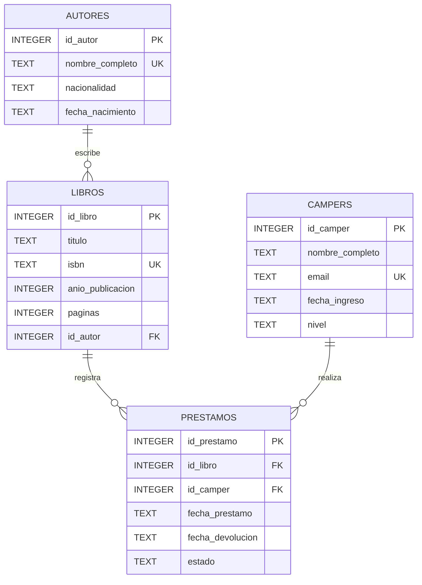

# Diagrama ER

El modelo de Biblioteca Tech está compuesto por cuatro tablas:

- `autores`
- `libros`
- `campers`
- `prestamos`

La tabla `prestamos` funciona como entidad transaccional y relaciona a los campers con los libros.

## Relaciones

- Un autor puede tener varios libros.
- Cada libro pertenece a un autor.
- Un camper puede realizar varios préstamos.
- Cada préstamo pertenece a un camper.
- Un libro puede aparecer en varios préstamos.
- Cada préstamo corresponde a un libro.

## Restricciones relevantes

- Las claves primarias identifican de forma única cada registro.
- Las claves foráneas mantienen la integridad referencial.
- Los ISBN de los libros son únicos.
- Los correos electrónicos de los campers son únicos.
- Los niveles de los campers están restringidos mediante `CHECK`.
- Los estados de los préstamos están restringidos mediante `CHECK`.
- Las fechas de devolución no pueden ser anteriores a la fecha del préstamo.