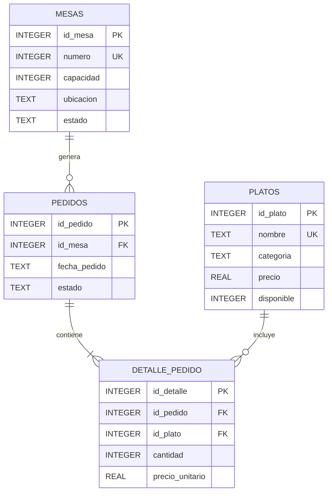

# Diagrama ER

El modelo de Restaurante Campus utiliza cuatro tablas:

- `mesas`
- `platos`
- `pedidos`
- `detalle_pedido`

La tabla `pedidos` representa la operación de consumo de una mesa, mientras que `detalle_pedido` permite registrar los platos incluidos en cada pedido.

## Relaciones

- Una mesa puede generar múltiples pedidos.
- Cada pedido pertenece a una mesa.
- Un pedido contiene uno o varios detalles.
- Cada detalle pertenece a un pedido.
- Un plato puede aparecer en múltiples detalles.
- Cada detalle referencia un plato específico.

## Integridad

Se utilizan claves foráneas para mantener la integridad entre mesas, pedidos, platos y detalles.

Además:

- El número de mesa es único.
- El nombre de cada plato es único.
- La capacidad de las mesas está limitada mediante `CHECK`.
- Los estados de las mesas están restringidos.
- Los precios deben ser mayores que cero.
- Las cantidades de los detalles deben ser mayores que cero.
- Los estados de los pedidos están restringidos.
- La combinación `id_pedido + id_plato` es única dentro de un pedido.