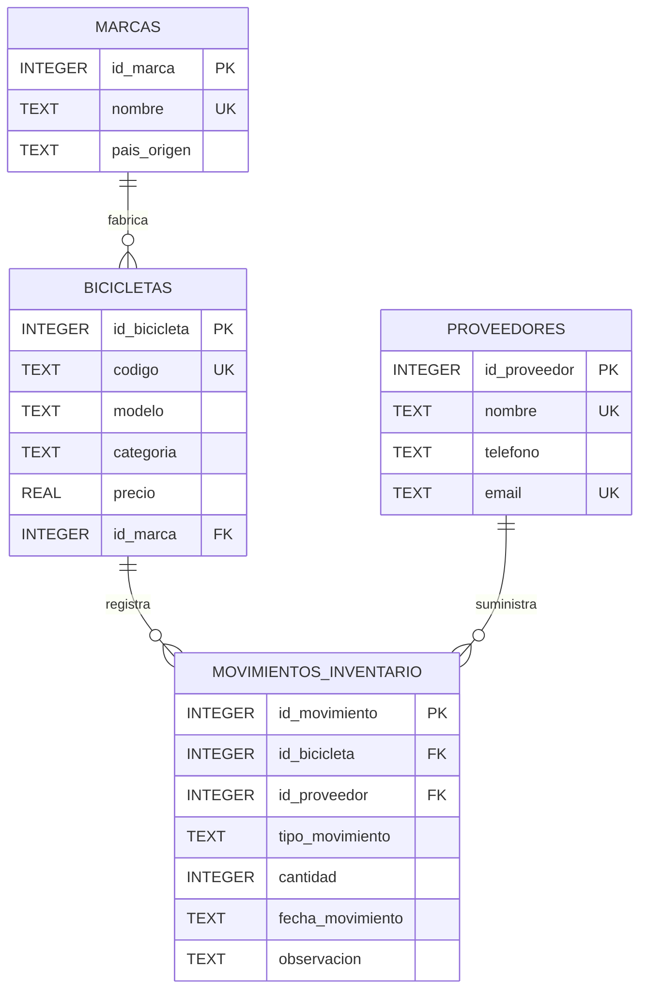

# Diagrama ER

El modelo de Inventario de Bicicletas está compuesto por cuatro tablas:

- `marcas`
- `proveedores`
- `bicicletas`
- `movimientos_inventario`

La tabla `movimientos_inventario` registra las entradas y salidas de cada bicicleta y relaciona las bicicletas con los proveedores.

## Relaciones

- Una marca puede tener múltiples bicicletas.
- Cada bicicleta pertenece a una marca.
- Una bicicleta puede tener múltiples movimientos de inventario.
- Cada movimiento corresponde a una bicicleta.
- Un proveedor puede participar en múltiples movimientos.
- Cada movimiento está asociado a un proveedor.

## Integridad y restricciones

- Las cuatro tablas utilizan `PRIMARY KEY`.
- Las relaciones se implementan mediante `FOREIGN KEY`.
- Los códigos de bicicleta son únicos.
- Los nombres de marcas y proveedores son únicos.
- Los correos de proveedores son únicos.
- Los precios deben ser mayores que cero.
- Las cantidades de movimientos deben ser mayores que cero.
- El tipo de movimiento solamente puede ser `ENTRADA` o `SALIDA`.
- Las categorías de bicicletas están restringidas mediante `CHECK`.
- Las fechas se almacenan utilizando formato ISO.
- SQLite tiene habilitadas las claves foráneas mediante `PRAGMA foreign_keys = ON`.