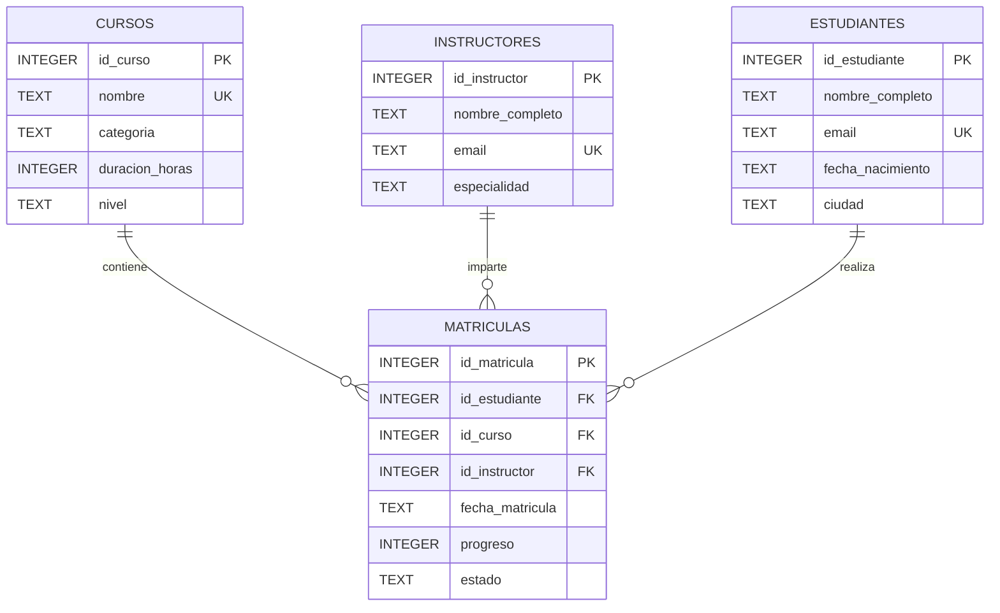

# Diagrama ER

El modelo de Academia de Cursos utiliza cuatro tablas:

- `cursos`
- `instructores`
- `estudiantes`
- `matriculas`

La tabla `matriculas` funciona como entidad transaccional y relaciona estudiantes, cursos e instructores.

## Relaciones

- Un curso puede tener múltiples matrículas.
- Un instructor puede estar asociado a múltiples matrículas.
- Un estudiante puede realizar múltiples matrículas.
- Cada matrícula pertenece a un único estudiante.
- Cada matrícula corresponde a un único curso.
- Cada matrícula tiene un instructor responsable.

## Restricciones

- Todas las tablas tienen `PRIMARY KEY`.
- Las relaciones utilizan `FOREIGN KEY`.
- Los nombres de cursos son únicos.
- Los correos de instructores son únicos.
- Los correos de estudiantes son únicos.
- La combinación estudiante-curso es única para evitar matrículas duplicadas.
- La duración de los cursos debe ser positiva.
- El nivel del curso está restringido mediante `CHECK`.
- El progreso debe estar entre 0 y 100.
- El estado de la matrícula está restringido mediante `CHECK`.
- Las fechas utilizan formato ISO.
- Las claves foráneas están habilitadas mediante `PRAGMA foreign_keys = ON`.