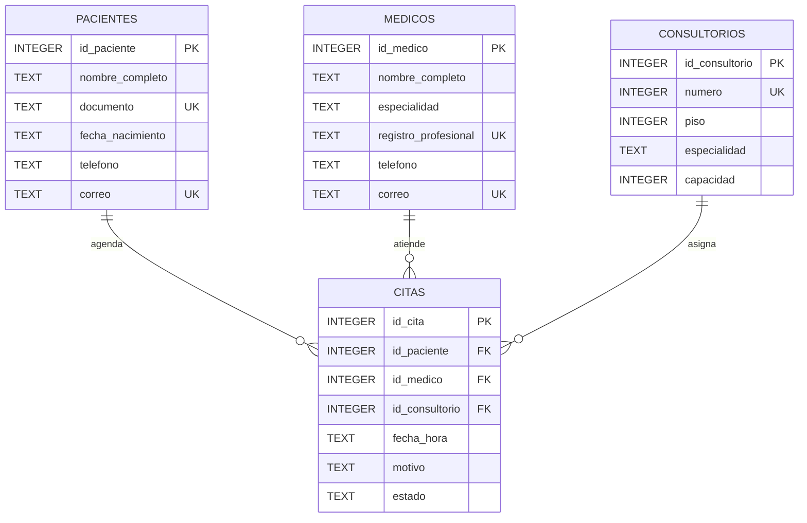

# Diagrama ER

## Modelo entidad-relacion

El modelo está compuesto por cuatro entidades: `pacientes`, `medicos`, `consultorios` y `citas`.

La tabla `citas` funciona como entidad central y relaciona pacientes, médicos y consultorios mediante llaves foráneas.

## Relaciones

- `pacientes` 1:N `citas`: un paciente puede tener múltiples citas y cada cita pertenece a un paciente.
- `medicos` 1:N `citas`: un médico puede atender múltiples citas y cada cita pertenece a un médico.
- `consultorios` 1:N `citas`: un consultorio puede utilizarse en múltiples citas en diferentes horarios y cada cita se asigna a un consultorio.
- `citas` posee restricciones `UNIQUE` sobre la combinación médico-fecha y consultorio-fecha para evitar conflictos de agenda.