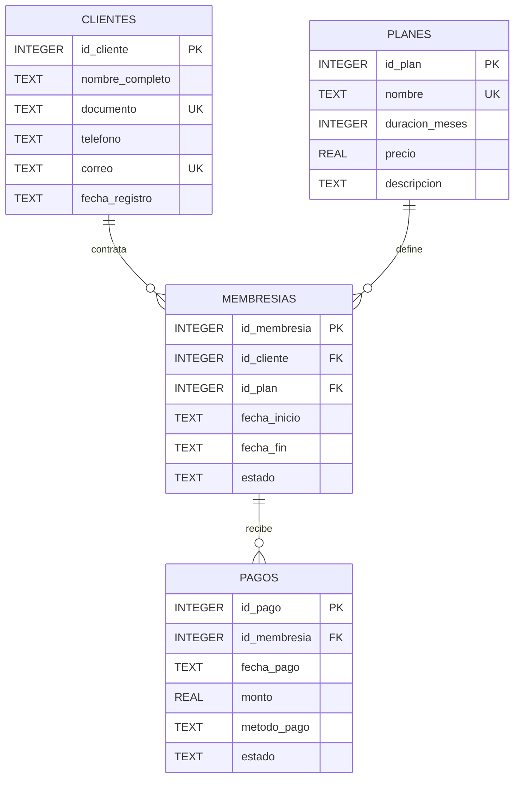

# Diagrama ER

## Modelo entidad-relacion

El modelo utiliza cuatro entidades: `clientes`, `planes`, `membresias` y `pagos`.

La tabla `membresias` funciona como entidad central para relacionar clientes con los planes contratados. La tabla `pagos` registra las transacciones asociadas a cada membresía.

## Relaciones

- `clientes` 1:N `membresias`: un cliente puede contratar múltiples membresías y cada membresía pertenece a un cliente.
- `planes` 1:N `membresias`: un plan puede ser contratado por múltiples clientes y cada membresía utiliza un plan.
- `membresias` 1:N `pagos`: una membresía puede tener múltiples pagos y cada pago pertenece a una membresía.
- `membresias` posee una restricción `UNIQUE` sobre cliente y fecha de inicio para evitar duplicar una membresía iniciada el mismo día.