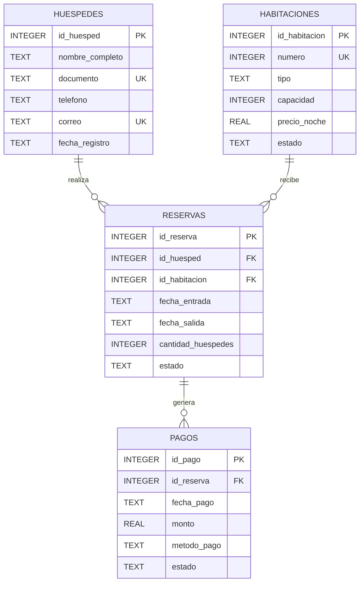

# Diagrama ER

## Modelo entidad-relacion

El modelo está compuesto por cuatro entidades: `huespedes`, `habitaciones`, `reservas` y `pagos`.

La tabla `reservas` funciona como entidad central y relaciona huéspedes con habitaciones. La tabla `pagos` registra las transacciones económicas asociadas a cada reserva.

## Relaciones

- `huespedes` 1:N `reservas`: un huésped puede realizar múltiples reservas y cada reserva pertenece a un huésped.
- `habitaciones` 1:N `reservas`: una habitación puede aparecer en múltiples reservas en diferentes períodos y cada reserva corresponde a una habitación.
- `reservas` 1:N `pagos`: una reserva puede tener múltiples pagos y cada pago pertenece a una reserva.
- `huespedes` utiliza `documento` y `correo` como valores únicos.
- `habitaciones` utiliza `numero` como identificador único del número físico.
- `reservas` utiliza `UNIQUE (id_habitacion, fecha_entrada)` para evitar duplicar reservas de una habitación con la misma fecha de entrada.