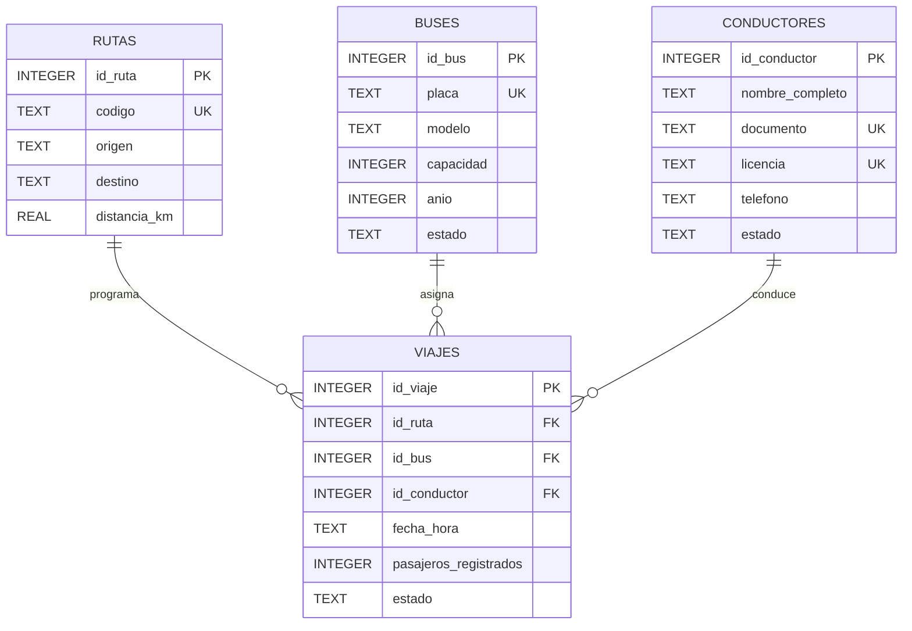

# Diagrama ER

## Modelo entidad-relacion

El modelo está compuesto por cuatro entidades: `rutas`, `buses`, `conductores` y `viajes`.

La tabla `viajes` funciona como entidad central y relaciona rutas, buses y conductores para representar cada viaje programado.

## Relaciones

- `rutas` 1:N `viajes`: una ruta puede tener múltiples viajes programados y cada viaje pertenece a una ruta.
- `buses` 1:N `viajes`: un bus puede participar en múltiples viajes en diferentes horarios y cada viaje utiliza un bus.
- `conductores` 1:N `viajes`: un conductor puede realizar múltiples viajes en diferentes horarios y cada viaje tiene un conductor.
- `rutas` utiliza `codigo` como identificador único.
- `buses` utiliza `placa` como identificador único.
- `conductores` utiliza `documento` y `licencia` como valores únicos.
- `viajes` utiliza `UNIQUE (id_bus, fecha_hora)` para impedir asignar el mismo bus a dos viajes simultáneos.
- `viajes` utiliza `UNIQUE (id_conductor, fecha_hora)` para impedir asignar el mismo conductor a dos viajes simultáneos.