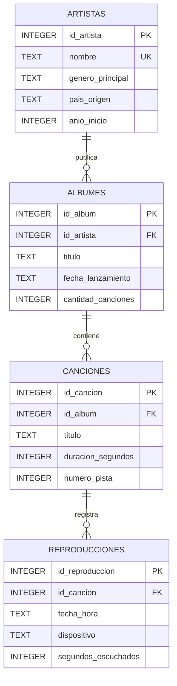

# Diagrama ER

## Modelo entidad-relacion

El modelo está compuesto por cuatro entidades: `artistas`, `albumes`, `canciones` y `reproducciones`.

La tabla `reproducciones` funciona como entidad central de actividad y registra cada reproducción asociada a una canción.

## Relaciones

- `artistas` 1:N `albumes`: un artista puede publicar múltiples álbumes y cada álbum pertenece a un artista.
- `albumes` 1:N `canciones`: un álbum contiene múltiples canciones y cada canción pertenece a un álbum.
- `canciones` 1:N `reproducciones`: una canción puede registrar múltiples reproducciones y cada reproducción pertenece a una canción.
- `artistas.nombre` es único.
- `albumes` utiliza una restricción única sobre `(id_artista, titulo)`.
- `canciones` utiliza restricciones únicas sobre `(id_album, numero_pista)` y `(id_album, titulo)`.
- Las fechas de lanzamiento utilizan el formato `YYYY-MM-DD`.
- Las fechas de reproducción utilizan el formato `YYYY-MM-DD HH:MM`.