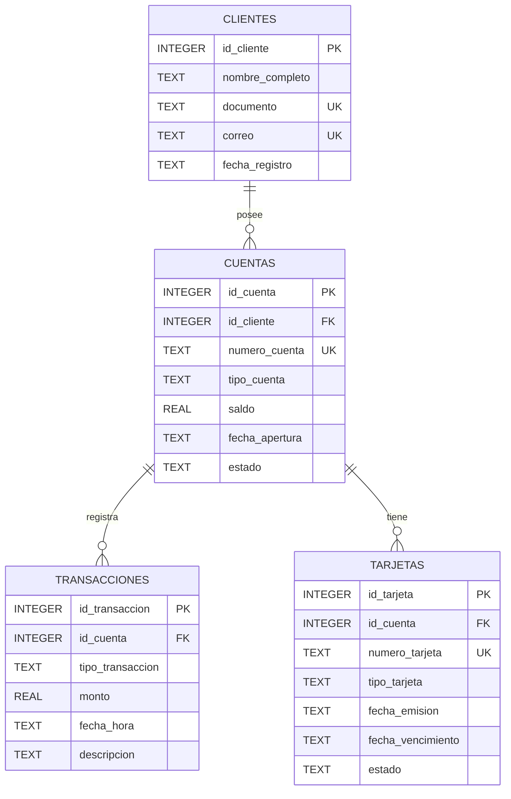

# Diagrama ER

## Modelo entidad-relacion

El modelo está compuesto por cuatro entidades: `clientes`, `cuentas`, `transacciones` y `tarjetas`.

La tabla `cuentas` representa la relación financiera principal de cada cliente, mientras que `transacciones` registra los movimientos realizados sobre las cuentas y `tarjetas` representa los medios asociados a ellas.

## Relaciones

- `clientes` 1:N `cuentas`: un cliente puede poseer múltiples cuentas y cada cuenta pertenece a un cliente.
- `cuentas` 1:N `transacciones`: una cuenta puede registrar múltiples movimientos y cada movimiento pertenece a una cuenta.
- `cuentas` 1:N `tarjetas`: una cuenta puede tener múltiples tarjetas y cada tarjeta pertenece a una cuenta.
- `clientes.documento` es único.
- `clientes.correo` es único.
- `cuentas.numero_cuenta` es único.
- `tarjetas.numero_tarjeta` es único.
- Las cuentas utilizan `CHECK` para controlar el tipo, saldo y estado.
- Las transacciones utilizan `CHECK` para controlar el tipo y monto.
- Las tarjetas utilizan `CHECK` para controlar tipo y estado.
- Las fechas se almacenan en formato ISO `YYYY-MM-DD` y `YYYY-MM-DD HH:MM`.