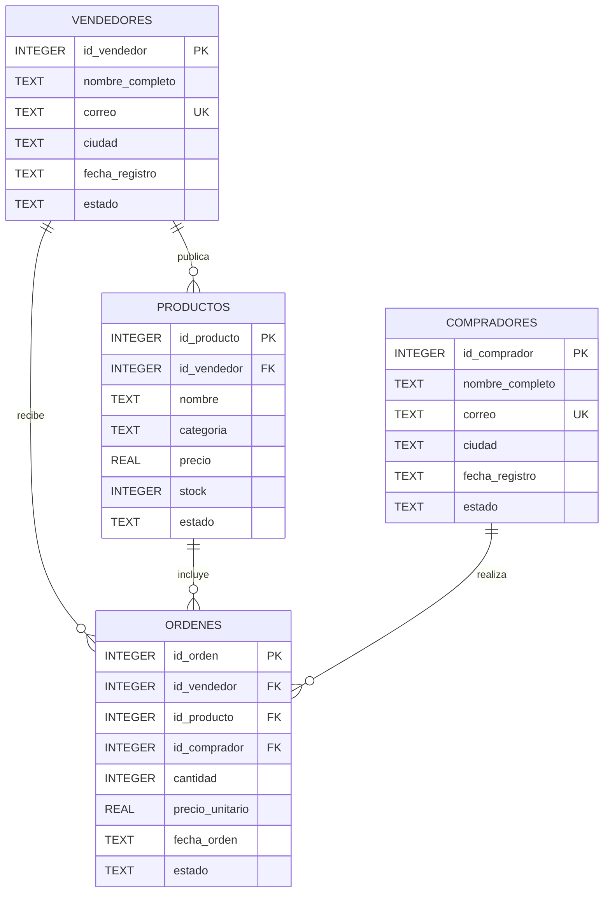

# Diagrama ER

## Modelo entidad-relación

El modelo está compuesto por cuatro entidades: `vendedores`, `productos`, `compradores` y `ordenes`.

La tabla `ordenes` representa la entidad transaccional central del marketplace y relaciona al comprador, al producto y al vendedor responsable de la venta.

## Relaciones

- `vendedores` 1:N `productos`: un vendedor puede publicar múltiples productos.
- `vendedores` 1:N `ordenes`: un vendedor puede recibir múltiples órdenes.
- `productos` 1:N `ordenes`: un producto puede aparecer en múltiples órdenes.
- `compradores` 1:N `ordenes`: un comprador puede realizar múltiples órdenes.
- Cada orden pertenece obligatoriamente a un vendedor, producto y comprador.
- `vendedores.correo` es único.
- `compradores.correo` es único.
- Los productos controlan precio, stock y estado mediante `CHECK`.
- Las órdenes controlan cantidad, precio, estado y formato de fecha mediante `CHECK`.