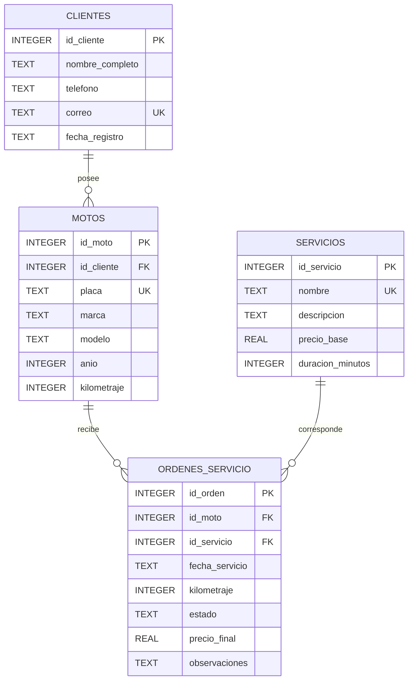

# Diagrama ER

## Relaciones

- `clientes` → `motos`: un cliente puede poseer varias motos.
- `motos` → `ordenes_servicio`: una moto puede tener múltiples órdenes de servicio.
- `servicios` → `ordenes_servicio`: un servicio puede utilizarse en múltiples órdenes.
- `ordenes_servicio` relaciona cada moto con el servicio realizado.

## Claves

- `clientes.id_cliente`: clave primaria.
- `motos.id_moto`: clave primaria.
- `servicios.id_servicio`: clave primaria.
- `ordenes_servicio.id_orden`: clave primaria.
- `motos.id_cliente`: clave foránea hacia `clientes`.
- `ordenes_servicio.id_moto`: clave foránea hacia `motos`.
- `ordenes_servicio.id_servicio`: clave foránea hacia `servicios`.
- `clientes.correo`, `motos.placa` y `servicios.nombre`: valores únicos.