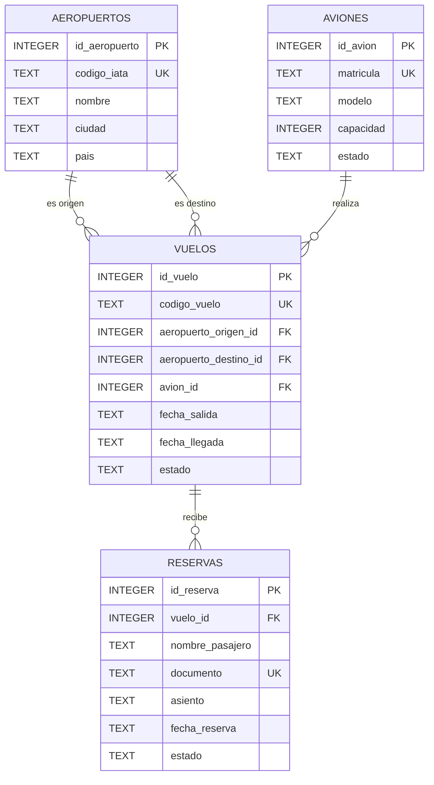

## Modelo

El modelo está compuesto por cuatro entidades:

- `aeropuertos`: almacena los aeropuertos disponibles para las operaciones de origen y destino.
- `aviones`: almacena las aeronaves, su capacidad y estado operativo.
- `vuelos`: representa los vuelos programados y relaciona un avión con dos aeropuertos.
- `reservas`: registra los pasajeros asociados a cada vuelo.

## Relaciones

- Un aeropuerto puede ser origen de muchos vuelos.
- Un aeropuerto puede ser destino de muchos vuelos.
- Un avión puede realizar muchos vuelos.
- Un vuelo puede tener muchas reservas.
- Cada reserva pertenece a un único vuelo.

## Restricciones representadas

- `PRIMARY KEY` en las cuatro tablas.
- `FOREIGN KEY` entre vuelos y aeropuertos, vuelos y aviones, y reservas y vuelos.
- `UNIQUE` para códigos IATA, matrículas, códigos de vuelo y documentos.
- `CHECK` para capacidad, estados, origen/destino y orden cronológico de las fechas.
- `UNIQUE (vuelo_id, asiento)` para impedir que un mismo asiento sea reservado dos veces en un vuelo.