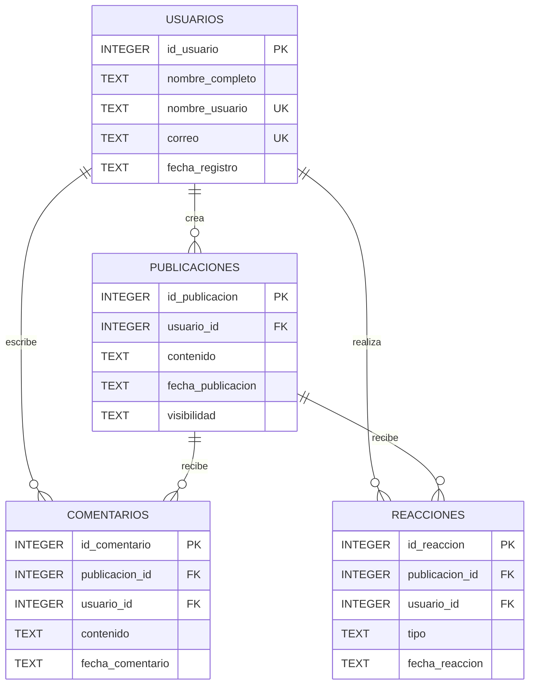

# Diagrama ER

## Modelo entidad-relacion

## Relaciones

- Un usuario puede crear cero o muchas publicaciones.
- Una publicación pertenece a un único usuario.
- Un usuario puede escribir cero o muchos comentarios.
- Un comentario pertenece a un único usuario y a una única publicación.
- Un usuario puede realizar cero o muchas reacciones.
- Una reacción pertenece a un único usuario y a una única publicación.
- La tabla `reacciones` utiliza una restricción `UNIQUE` sobre `(publicacion_id, usuario_id)` para evitar que un mismo usuario reaccione más de una vez a una publicación.
- Las relaciones se implementan mediante llaves foráneas.