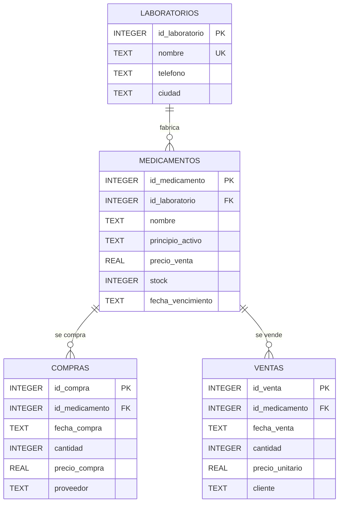

# Diagrama ER

## Ejercicio 18: Farmacia Inventario

## Relaciones

- `laboratorios` tiene una relación de uno a muchos con `medicamentos`.
- `medicamentos` tiene una relación de uno a muchos con `compras`.
- `medicamentos` tiene una relación de uno a muchos con `ventas`.
- Cada medicamento pertenece obligatoriamente a un laboratorio.
- Cada compra corresponde obligatoriamente a un medicamento.
- Cada venta corresponde obligatoriamente a un medicamento.

## Restricciones representadas

- `PRIMARY KEY` en las cuatro entidades.
- `FOREIGN KEY` entre laboratorios y medicamentos.
- `FOREIGN KEY` entre medicamentos y compras.
- `FOREIGN KEY` entre medicamentos y ventas.
- `UNIQUE` en el nombre del laboratorio.
- `UNIQUE` compuesto entre nombre del medicamento y laboratorio.
- `CHECK` para precios positivos.
- `CHECK` para cantidades y stock válidos.
- `CHECK` para fechas con formato interpretable por SQLite.