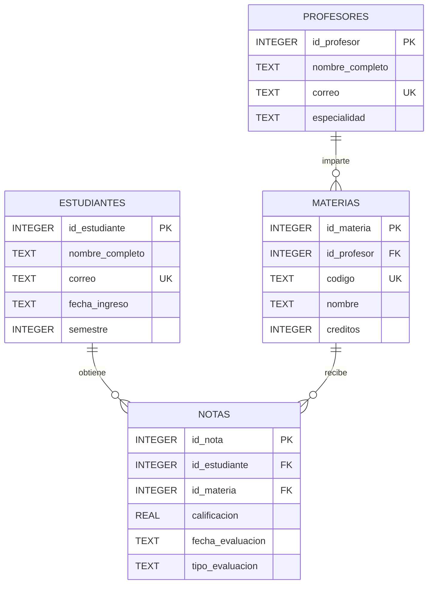

# Diagrama ER

## Ejercicio 19: Universidad Notas

## Relaciones

- `profesores` mantiene una relación de uno a muchos con `materias`.
- `estudiantes` mantiene una relación de uno a muchos con `notas`.
- `materias` mantiene una relación de uno a muchos con `notas`.
- Cada materia pertenece obligatoriamente a un profesor.
- Cada nota pertenece obligatoriamente a un estudiante.
- Cada nota corresponde obligatoriamente a una materia.

## Restricciones relevantes

- `PRIMARY KEY` en las cuatro tablas.
- `FOREIGN KEY` entre profesores y materias.
- `FOREIGN KEY` entre estudiantes y notas.
- `FOREIGN KEY` entre materias y notas.
- `UNIQUE` en los correos de estudiantes y profesores.
- `UNIQUE` en el código de materia.
- `UNIQUE` compuesto para evitar duplicar una evaluación del mismo estudiante, materia, fecha y tipo.
- `CHECK` para mantener semestres válidos.
- `CHECK` para mantener créditos entre 1 y 6.
- `CHECK` para mantener calificaciones entre 0 y 5.
- `CHECK` para restringir los tipos de evaluación permitidos.