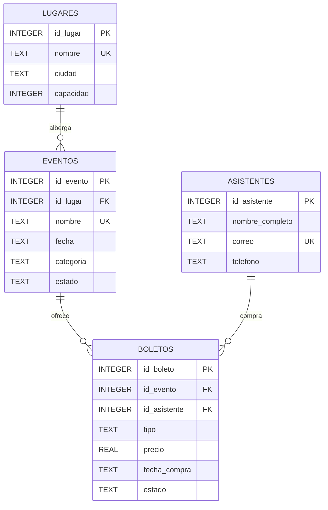

## Ejercicio 20: Eventos Boletos

## Restricciones principales

- `LUGARES.nombre` es único.
- `EVENTOS.nombre` es único.
- `ASISTENTES.correo` es único.
- `BOLETOS` evita que un asistente compre más de un boleto para el mismo evento mediante `UNIQUE(id_evento, id_asistente)`.
- `LUGARES.capacidad` debe ser mayor que cero.
- `EVENTOS.fecha` debe representar una fecha válida.
- `EVENTOS.estado` utiliza los valores `programado`, `finalizado` o `cancelado`.
- `ASISTENTES.nombre_completo` requiere al menos cinco caracteres.
- `ASISTENTES.correo` debe contener `@`.
- `BOLETOS.precio` debe ser mayor que cero.
- `BOLETOS.tipo` utiliza `general`, `vip` o `preferencial`.
- `BOLETOS.estado` utiliza `activo`, `usado` o `cancelado`.
- Las claves foráneas mantienen la integridad entre lugares, eventos, asistentes y boletos.