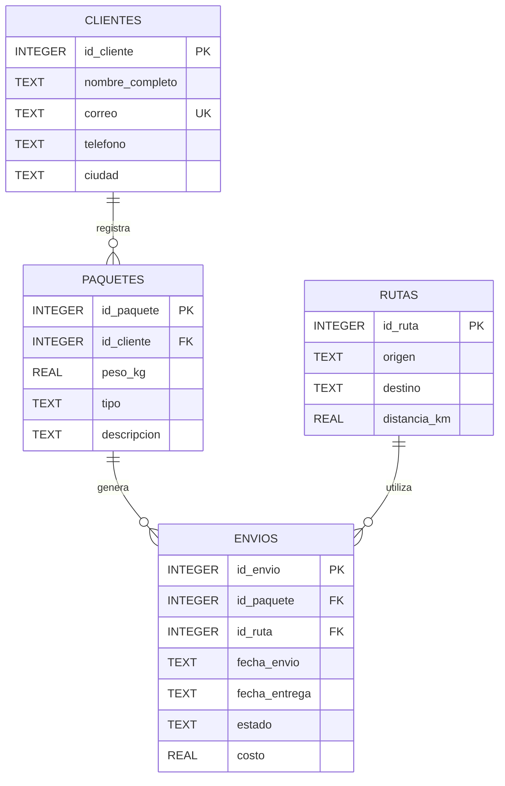

## Modelo

El modelo representa una empresa de logística dedicada al seguimiento de paquetes y envíos. Los clientes registran paquetes, y cada envío relaciona un paquete con una ruta determinada.

## Relaciones

- `clientes` mantiene la información de los remitentes.
- `paquetes` registra los paquetes asociados a cada cliente.
- `rutas` define los trayectos disponibles entre origen y destino.
- `envios` representa la operación logística y relaciona paquetes con rutas.
- Un cliente puede registrar varios paquetes.
- Un paquete puede tener uno o varios registros de envío.
- Una ruta puede ser utilizada por varios envíos.

## Restricciones relevantes

- Todas las tablas poseen `PRIMARY KEY`.
- Las relaciones utilizan `FOREIGN KEY`.
- Los campos obligatorios utilizan `NOT NULL`.
- `clientes.correo` es `UNIQUE`.
- `rutas.origen` y `rutas.destino` deben ser diferentes.
- `rutas.distancia_km` debe ser mayor que cero.
- `paquetes.peso_kg` debe ser mayor que cero.
- `paquetes.tipo` solo acepta `DOCUMENTO`, `CAJA` o `SOBRE`.
- `envios.estado` solo acepta `PENDIENTE`, `EN_TRANSITO`, `ENTREGADO` o `CANCELADO`.
- `envios.costo` debe ser mayor que cero.
- `fecha_entrega` no puede ser anterior a `fecha_envio`.
- Las claves foráneas están activadas mediante `PRAGMA foreign_keys = ON`.