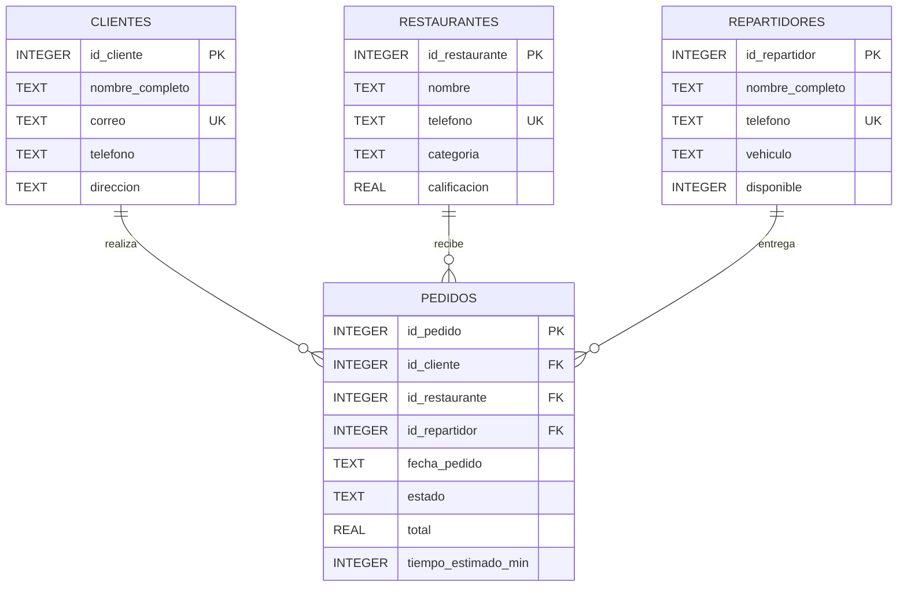

# Diagrama ER

## Modelo

El modelo representa un servicio de delivery que administra clientes, restaurantes, repartidores y pedidos. La entidad `pedidos` concentra la operación principal y relaciona al cliente, restaurante y repartidor involucrados.

## Relaciones

- `clientes` almacena los usuarios que realizan pedidos.
- `restaurantes` almacena los establecimientos que reciben los pedidos.
- `repartidores` registra las personas encargadas de entregar los pedidos.
- `pedidos` representa la entidad transaccional central.
- Un cliente puede realizar múltiples pedidos.
- Un restaurante puede recibir múltiples pedidos.
- Un repartidor puede entregar múltiples pedidos.

## Restricciones relevantes

- Todas las tablas poseen `PRIMARY KEY`.
- `pedidos` utiliza tres `FOREIGN KEY`.
- Los campos obligatorios utilizan `NOT NULL`.
- Los correos y teléfonos utilizan `UNIQUE` donde corresponde.
- La calificación de los restaurantes debe estar entre 1 y 5.
- El tipo de vehículo de los repartidores está limitado a `MOTO`, `BICICLETA` o `AUTOMOVIL`.
- La disponibilidad de los repartidores solo admite `0` o `1`.
- Los estados de los pedidos están restringidos a valores válidos.
- El total y el tiempo estimado deben ser mayores que cero.
- Las claves foráneas están activadas mediante `PRAGMA foreign_keys = ON`.