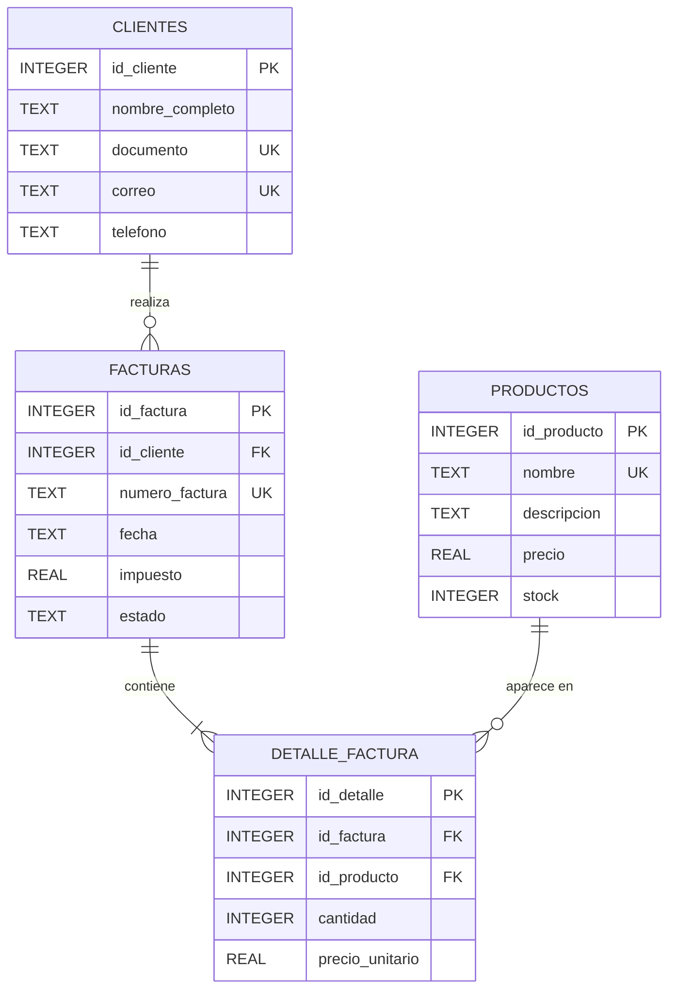

# Diagrama ER

## Modelo

El sistema de facturación está compuesto por cuatro entidades: clientes, productos, facturas y detalle de factura.

Las facturas pertenecen a un cliente y cada factura puede contener múltiples productos mediante la tabla `detalle_factura`.

## Relaciones

- `clientes` tiene una relación de uno a muchos con `facturas`.
- `facturas` tiene una relación de uno a muchos con `detalle_factura`.
- `productos` tiene una relación de uno a muchos con `detalle_factura`.
- `detalle_factura` funciona como entidad asociativa entre facturas y productos.
- La combinación `id_factura` e `id_producto` es única dentro de `detalle_factura`.

## Restricciones representadas

- Claves primarias en las cuatro tablas.
- Claves foráneas entre facturas, clientes y detalle de factura.
- Restricciones `UNIQUE` en documentos, correos, productos y números de factura.
- Restricciones `CHECK` para precios, cantidades, stock, impuestos, fechas y estados.