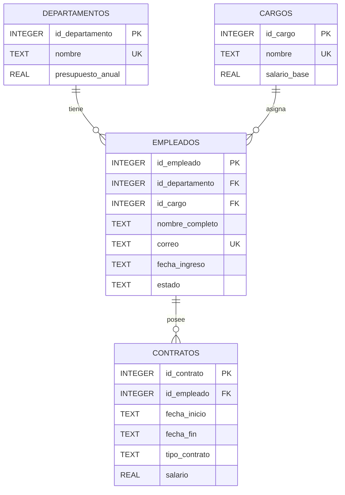

# Diagrama ER

## Modelo entidad-relación

## Relaciones

- Un departamento puede tener cero o muchos empleados.
- Un empleado pertenece obligatoriamente a un departamento.
- Un cargo puede estar asignado a cero o muchos empleados.
- Un empleado tiene obligatoriamente un cargo.
- Un empleado puede tener cero o muchos contratos.
- Cada contrato pertenece obligatoriamente a un empleado.

## Restricciones representadas

- `PK`: llave primaria.
- `FK`: llave foránea.
- `UK`: restricción `UNIQUE`.
- `NOT NULL`: aplicada a los atributos obligatorios.
- `CHECK`: aplicada a presupuestos, salarios, fechas, estados y tipos de contrato.