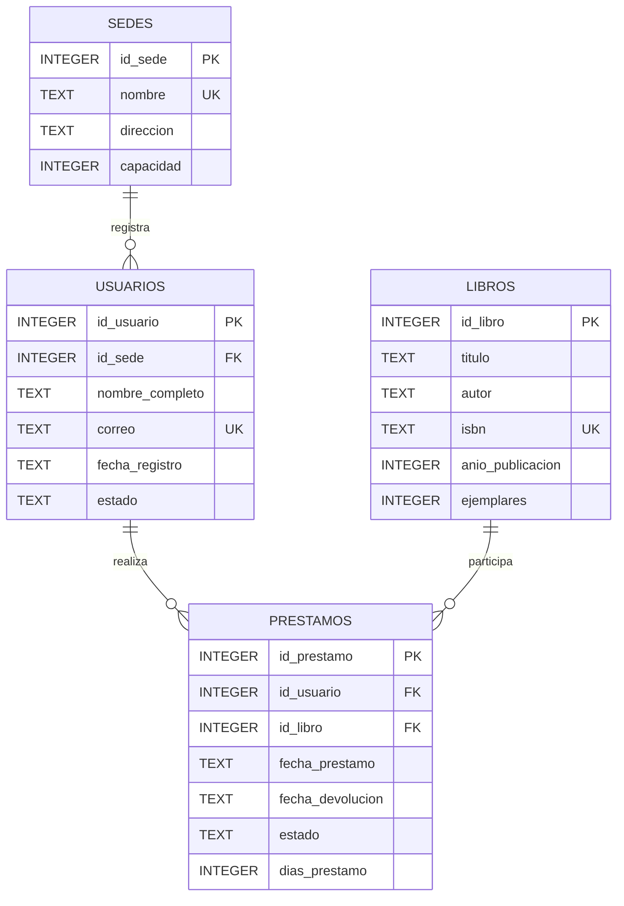

# Diagrama ER

## Modelo entidad-relación

## Relaciones

- Una sede puede registrar cero o muchos usuarios.
- Cada usuario pertenece obligatoriamente a una sede.
- Un usuario puede realizar cero o muchos préstamos.
- Cada préstamo pertenece obligatoriamente a un usuario.
- Un libro puede participar en cero o muchos préstamos.
- Cada préstamo referencia obligatoriamente un libro.

## Restricciones relevantes

- `PK`: llave primaria.
- `FK`: llave foránea.
- `UK`: restricción `UNIQUE`.
- `NOT NULL`: campos obligatorios.
- `CHECK`: validación de capacidad, año, ejemplares, fechas, estados y duración del préstamo.