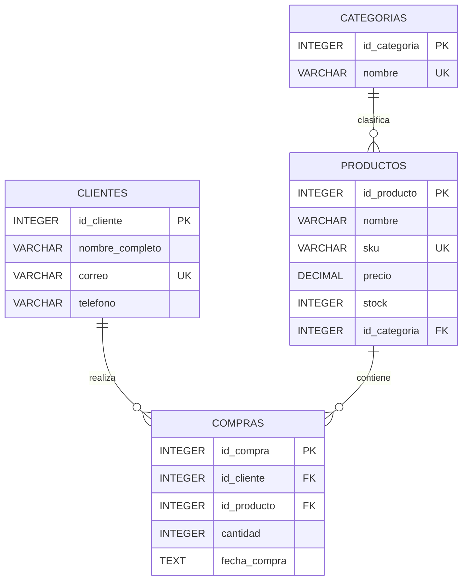

# Diagrama ER

## Modelo relacional

El modelo está normalizado hasta tercera forma normal (3FN) y utiliza cuatro tablas con responsabilidades independientes.

## Relaciones

- `categorias` mantiene el catálogo independiente de categorías.
- `productos` pertenece a una categoría mediante `id_categoria`.
- `clientes` mantiene los datos independientes de cada cliente.
- `compras` registra cada operación y relaciona un cliente con un producto mediante claves foráneas.
- La información de categoría no se repite dentro de `productos`.
- La información del cliente no se repite dentro de `compras`.
- La información del producto no se repite dentro de `compras`.

## Cardinalidades

- Una categoría puede tener cero o muchos productos.
- Cada producto pertenece obligatoriamente a una categoría.
- Un cliente puede realizar cero o muchas compras.
- Cada compra pertenece obligatoriamente a un cliente.
- Un producto puede aparecer en cero o muchas compras.
- Cada compra referencia obligatoriamente un producto.