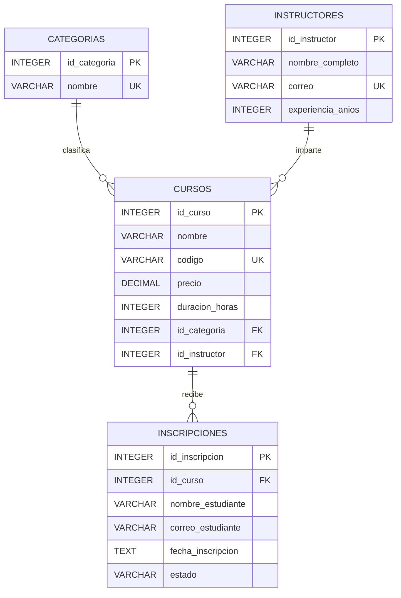

# Diagrama ER

## Modelo relacional

El modelo utiliza cuatro tablas para administrar categorías, instructores, cursos e inscripciones.

## Relaciones

- Una categoría puede contener cero o muchos cursos.
- Cada curso pertenece obligatoriamente a una categoría.
- Un instructor puede impartir cero o muchos cursos.
- Cada curso tiene obligatoriamente un instructor.
- Un curso puede tener cero o muchas inscripciones.
- Cada inscripción pertenece obligatoriamente a un curso.

## Restricciones

- Las claves primarias identifican cada registro.
- Los nombres de categorías son únicos.
- Los correos de instructores son únicos.
- Los códigos de cursos son únicos.
- El precio de cada curso debe ser mayor que cero.
- La duración de cada curso debe ser mayor que cero.
- Los estados de inscripción están limitados a `Activa`, `Completada` y `Cancelada`.
- Las relaciones utilizan claves foráneas con integridad referencial.