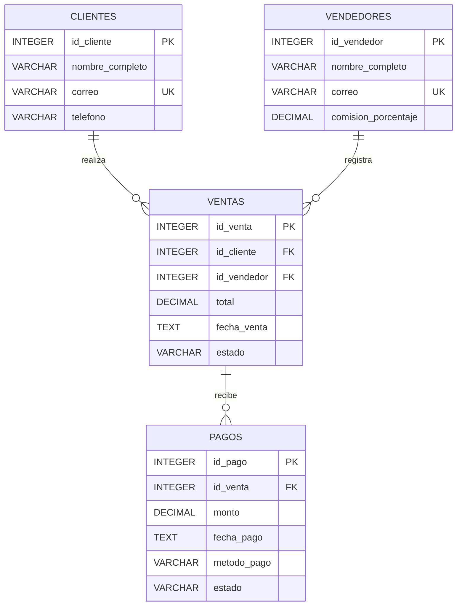

# Diagrama ER

## Modelo relacional

El sistema de ventas utiliza cuatro tablas principales. Las vistas de reportes se construyen sobre estas tablas y no representan entidades físicas adicionales.

## Relaciones

- Un cliente puede realizar cero o muchas ventas.
- Cada venta pertenece obligatoriamente a un cliente.
- Un vendedor puede registrar cero o muchas ventas.
- Cada venta pertenece obligatoriamente a un vendedor.
- Una venta puede tener cero o muchos pagos.
- Cada pago pertenece obligatoriamente a una venta.

## Vistas

El esquema incluye tres vistas destinadas a reportes:

- `vw_resumen_ventas`: presenta las ventas junto con el cliente y vendedor.
- `vw_estado_pagos`: muestra el total vendido, el total pagado y el saldo pendiente.
- `vw_ventas_vendedores`: resume el rendimiento de cada vendedor.

Las vistas no agregan tablas al modelo físico y utilizan las cuatro tablas definidas por el ejercicio.