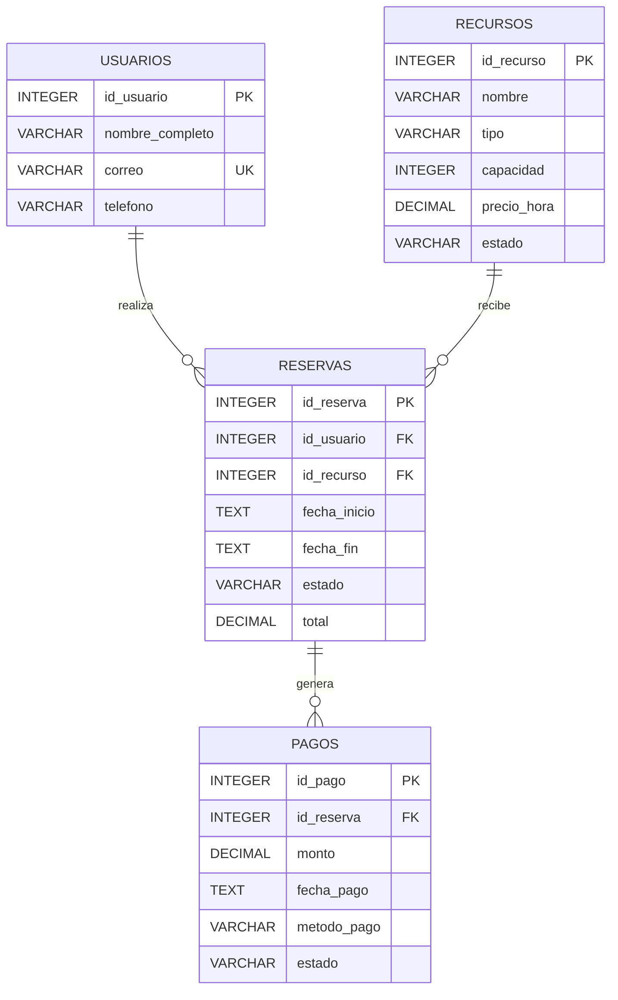

# Diagrama ER

## Modelo relacional

El sistema de reservas utiliza cuatro tablas principales. Las transacciones se realizan sobre reservas y pagos para mantener la consistencia de las operaciones.

## Relaciones

- Un usuario puede realizar cero o muchas reservas.
- Cada reserva pertenece obligatoriamente a un usuario.
- Un recurso puede estar asociado a cero o muchas reservas.
- Cada reserva utiliza obligatoriamente un recurso.
- Una reserva puede tener cero o muchos pagos.
- Cada pago pertenece obligatoriamente a una reserva.

## Restricciones

- Las claves primarias identifican cada registro.
- Los correos de usuarios son únicos.
- La capacidad de los recursos debe ser mayor que cero.
- El precio por hora debe ser mayor que cero.
- La fecha de finalización debe ser posterior a la fecha de inicio.
- Los estados de reserva están limitados a valores válidos.
- Los montos de reservas y pagos deben ser positivos.
- Los métodos de pago están limitados a valores válidos.
- Los estados de pago están limitados a valores válidos.
- Las relaciones utilizan claves foráneas con integridad referencial.