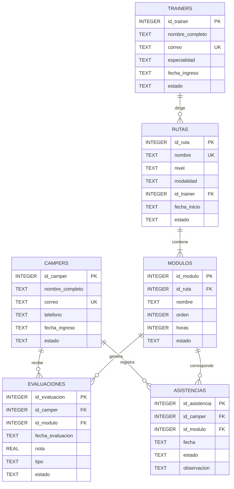

# Diagrama ER

## Modelo relacional

La plataforma académica integral se modela mediante seis entidades relacionadas. `campers` representa a los estudiantes, `trainers` a los responsables académicos, `rutas` los recorridos formativos, `modulos` los componentes de cada ruta, `evaluaciones` los resultados académicos y `asistencias` el control de participación.

## Relaciones

- Un trainer puede dirigir una o varias rutas.
- Cada ruta pertenece obligatoriamente a un trainer.
- Una ruta contiene uno o varios módulos.
- Cada módulo pertenece obligatoriamente a una ruta.
- Un camper puede tener múltiples evaluaciones.
- Cada evaluación pertenece a un camper y a un módulo.
- Un camper puede tener múltiples registros de asistencia.
- Cada asistencia pertenece a un camper y a un módulo.

## Restricciones relevantes

- Las claves primarias identifican cada registro.
- Los correos de campers y trainers son únicos.
- Los nombres de las rutas son únicos.
- La nota de una evaluación debe estar entre 0 y 100.
- El orden de los módulos debe ser mayor que cero.
- Las horas de los módulos deben ser mayores que cero.
- Los valores de nivel, modalidad y estados están restringidos mediante `CHECK`.
- Las combinaciones de ruta y orden de módulo son únicas.
- Las combinaciones de ruta y nombre de módulo son únicas.
- Las combinaciones de camper, módulo y fecha de evaluación son únicas.
- Las combinaciones de camper, módulo y fecha de asistencia son únicas.
- Todas las relaciones se implementan mediante claves foráneas.