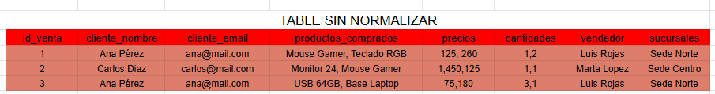
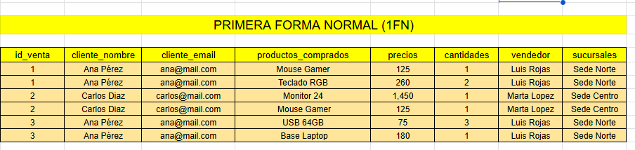
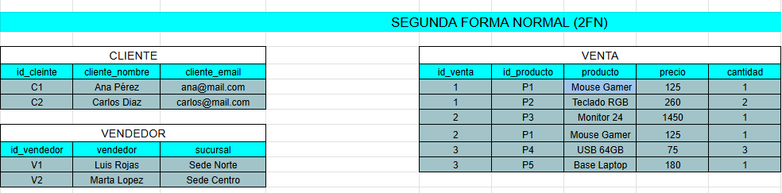
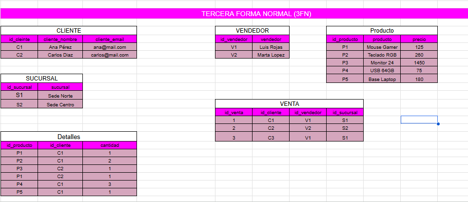

# Analisis de Normalizacion - Ejercicio 31

## Tabla original

Describa la tabla sin normalizar del archivo `datos/datos-sin-normalizar.csv`.



## Problemas detectados

- Grupos repetidos: si
- Datos duplicados: si
- Dependencias parciales: si
- Dependencias transitivas: no
- Anomalias de insercion: si
- Anomalias de actualizacion: si
- Anomalias de eliminacion: si

## Dependencias funcionales

Escriba las dependencias funcionales principales.

```text
Tabla SUCURSAL: id_sucursal -> sucursal
Tabla VENDEDOR: id_vendedor -> vendedor
Tabla PRODUCTO: id_producto -> producto, precio
Tabla VENTA: id_venta -> id_cliente, id_vendedor, id_sucursal
Tabla DETALLES: id_producto, id_cliente -> cantidad
```

## Primera Forma Normal (1FN)

Cambios: En la columna de producto vendidos cada cliente que realizó la compra tenia dos productos, debido a que la primera fase no debe tener dos productos en una misma linea, se separaron los productos en diferentes filas para que esté mas organizado.


## Segunda Forma Normal (2FN)

Explique que dependencias parciales elimino.

Se dividió en diferentes tablas para cada bloque especifico, esto dependiendo de los datos que se realacionan, estos son ventas, cliente y vendedor.


## Tercera Forma Normal (3FN)

Explique que dependencias transitivas elimino.

Se dividió en diferentes tablas debido a que la informacion no debía depender de esto y para organizar mejor esto.


## Modelo final

Liste cada tabla final, su llave primaria y sus llaves foraneas.

| Tabla | Llave primaria | Llaves foraneas | Proposito |
| --- | --- | --- | --- |
| | | | |


| Tabla | Llave primaria | Llaves foráneas | Propósito |
| :--- | :--- | :--- | :--- |
| **CLIENTE** | `id_cliente` | *Ninguna* | Almacenar la información de contacto de los clientes que realizan compras. |
| **SUCURSAL** | `id_sucursal` | *Ninguna* | Registrar los diferentes puntos de venta o sedes físicas del negocio. |
| **VENDEDOR** | `id_vendedor` | *Ninguna* | Mantener el registro del personal de ventas que atiende a los clientes. |
| **PRODUCTO** | `id_producto` | *Ninguna* | Catalogar los artículos disponibles para la venta junto con sus precios. |
| **VENTA** | `id_venta` | `id_cliente` (Ref. CLIENTE)<br>`id_vendedor` (Ref. VENDEDOR)<br>`id_sucursal` (Ref. SUCURSAL) | Registrar el encabezado de la transacción, identificando quién compró, quién atendió y en qué sede se realizó. |
| **DETALLES** | `id_venta`, `id_producto` *(Compuesta)* | `id_venta` (Ref. VENTA)<br>`id_producto` (Ref. PRODUCTO) | Romper la relación muchos a muchos entre Ventas y Productos, registrando qué artículos y qué cantidad se incluyeron en cada venta. |
## Justificacion

Explique por que el modelo final reduce duplicidad y evita anomalias.

Debido que la normalizacion nos ayuda a organizar mejor las cosas atraves de id y separarlo, y organizar mejor esta informacion.