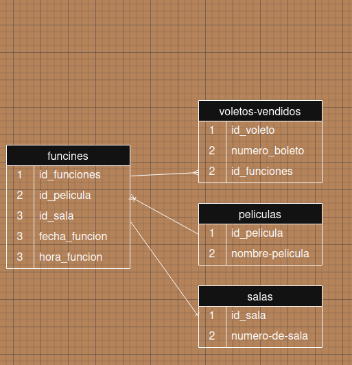

# CineMax

Disfruta tus mejores momentos con nosotros, comparte en familia.

## Necesidad de mejora.

- CineMax tiene la necesidad de innovar su forma de recolpilar los datos, estos se manejan manualmente impidiendo la fluidez de generacion de reportes. 

# Entidades

```
    Estableciendo las siguientes entidades:

        * peliculas
        * salas
        * funciones
        * boletos

    mantendremos separados nuestros datos gestionados. Adaptandolo la informcion de los peliculas, salas, funciones y boletos.

```
# Diagrama de organizacion de datos.



# Tecnologias y herramientas utilizadas.

```
    Visual Studio Code
    github
    SQLite
´´´
# autor

```
    Brandon Estiben Ixen
    ixenbrandonestiben@gmail.com
```