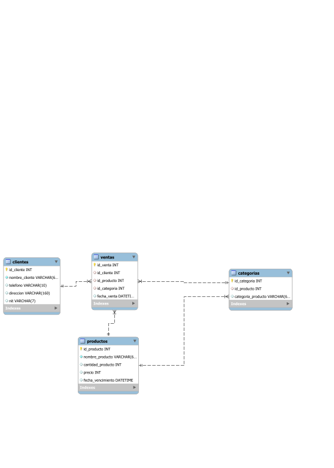

# ==   campus shop  ==
**Autor:** Estiben Ixen  
**Fecha:** 22 de agosto de 2026

>**campus shop** tienda dedicada a la venta de productos tecnologicos.

**problema detectado y planteado por el cliente:** Actualmente la campus shop cuenta con el problema de la dificil gestión del inventario de ventas, ya que  Actualmente registra manualmente productos, categorias, clientes y ventas, lo que provoca duplicidad, errores de captura y dificultad para generar reportes.


La base de datos **campus_shop** con el objetivo de resolver la mala gestion de inventarios, registros, y ventas realizadas, cuenta con cuatro tablas principales, que a continuacion se detallaran.

tablas:

>    **clientes** En esta tabla se registran todos los clientes que hacen sus compras, guardando su nombre obligatoriamente, telefono de forma unica, direccion, y su nit agregandole un **id** auto incrementable por cada cliente. Estos campos fueron seleccionados ya que es lo principal y lo mas necesario para esta tienda por el tipo de pedidos que se realizan.

>    **productos** Aqui se registran todos los productos que se tienen en la tienda, recopilando los siguientes datos de los productos: nombre, cantidad, precio, asignandoles un **id** auto incrementable a cada producto.

>    **categorias**  Esta tabla sera la encargada de almacenar la informacion de los diferentes tipos de productos, registrando los siguientes datos: **id_producto**, **categoria_producto**, teniendo asi una llave foranea que mantiene la realcion con la tabla productos.

>    **ventas** Almacena todas las ventas realizadas en la tienda, guardando el id del cliente, id del producto y id de la ategoria del producto, asi mismo registra la fecha del dia en que se realiza la venta. Esta tabla nos permite llamar todos los datos necesarios sobre los productos, categorias, y cientes para registrar la venta realizada y mantener un historial de ventas.

---
--- 

## Datos de prueva.

Los datos de prueba representan cuatro clientes, cuatro productos, cuatro
categorías y cinco ventas. Las ventas relacionan clientes y productos mediante
sus identificadores, por lo que permiten comprobar el historial de compras y
las consultas con `JOIN`.

### Clientes registrados

| ID | Cliente | Teléfono | Dirección | NIT |
| --- | --- | --- | --- | --- |
| 1 | Juan Pérez | 5551234 | Zona 1, Guatemala | 1234567 |
| 2 | María López | 5555678 | Zona 10, Guatemala | 2345678 |
| 3 | Carlos Gómez | 5559012 | Mixco, Guatemala | 3456789 |
| 4 | Ana Martínez | 5553456 | Villa Nueva, Guatemala | 4567890 |

### Productos y categorías

| ID producto | Producto | Cantidad | Precio | Categoría |
| --- | --- | ---: | ---: | --- |
| 1 | Laptop Lenovo | 10 | 5500 | Computadoras |
| 2 | Mouse Logitech | 50 | 150 | Accesorios |
| 3 | Teclado Mecánico | 30 | 300 | Accesorios |
| 4 | Monitor Samsung | 20 | 1200 | Pantallas |

### Ventas registradas

| Cliente | Producto | Categoría |
| --- | --- | --- |
| Juan Pérez | Laptop Lenovo | Computadoras |
| María López | Mouse Logitech | Accesorios |
| Carlos Gómez | Teclado Mecánico | Accesorios |
| Ana Martínez | Monitor Samsung | Pantallas |
| Juan Pérez | Mouse Logitech | Accesorios |

## Relaciones entre tablas

- `productos` es la tabla principal del inventario y se relaciona con
	`categorias` mediante `categorias.id_producto`.
- `clientes` almacena los compradores y se relaciona con `ventas` mediante
	`ventas.id_cliente`.
- `productos` se relaciona con `ventas` mediante `ventas.id_producto`.
- `categorias` se relaciona con `ventas` mediante `ventas.id_categoria`.
- `ventas` funciona como tabla transaccional: cada registro representa una
	compra y guarda la fecha automáticamente con `CURRENT_TIMESTAMP`.

## Restricciones aplicadas

- Cada tabla tiene una llave primaria autoincrementable.
- `clientes.nombre_cliente` y `productos.nombre_producto` son obligatorios con
	`NOT NULL`.
- `clientes.telefono` debe ser único mediante `UNIQUE`.
- `productos.cantidad_producto` debe cumplir la condición `CHECK` de cantidad
	mayor que uno.
- Las llaves foráneas de `categorias` y `ventas` evitan referencias a
	productos, clientes o categorías inexistentes.
- `ventas.fecha_venta` usa la fecha y hora actual como valor predeterminado.

## Consultas y reportes

El archivo `dql/consultas.sql` contiene las consultas solicitadas para revisar
la información de la base de datos:

1. Lista las ventas ordenadas de la más reciente a la más antigua.
2. Muestra el producto vendido y la fecha de venta.
3. Filtra las ventas de los últimos diez días.
4. Ordena las ventas por fecha.
5. Muestra las cinco ventas más recientes.
6. Cuenta la cantidad de productos registrados.
7. Calcula el precio promedio, mínimo y máximo.
8. Agrupa las ventas para conocer el total vendido por producto.
9. Une productos y categorías para mostrar el inventario clasificado.
10. Consulta las últimas cinco compras realizadas por el cliente con ID `1`.
11. Genera un reporte con nombres de columnas legibles.
12. Identifica los productos con mayor cantidad de ventas para apoyar decisiones
		de inventario.

## Archivos de la solución

- `ddl/schema.sql`: creación de la base de datos y sus tablas.
- `dml/inserts.sql`: inserción de clientes, productos, categorías y ventas.
- `dml/operaciones.sql`: espacio destinado a operaciones `INSERT`, `UPDATE` y
	`DELETE` adicionales.
- `dql/consultas.sql`: consultas de análisis y reportes.
- `diagramas/diagrame-relacional.svg`: diagrama entidad-relación de la base de
	datos `campus_shop`.

## Diagrama entidad-relación

El diagrama muestra las cuatro tablas de la solución y sus relaciones mediante
llaves primarias y foráneas. `ventas` concentra las relaciones con
`clientes`, `productos` y `categorias`, mientras que `categorias` clasifica los
productos del inventario.



[Abrir el diagrama entidad-relación](diagramas/diagrame-relacional.svg)

## Como ejecutar

La solución está escrita con sintaxis de **MySQL** (`CREATE DATABASE`, `USE`,
`AUTO_INCREMENT` y `CURRENT_TIMESTAMP`). Desde la carpeta de este ejercicio se
pueden ejecutar los archivos en este orden:

```bash
mysql -u usuario -p < ddl/schema.sql
mysql -u usuario -p campus_shop < dml/inserts.sql
mysql -u usuario -p campus_shop < dml/operaciones.sql
mysql -u usuario -p campus_shop < dql/consultas.sql
```

Antes de ejecutar el esquema es necesario revisar los separadores de algunas
definiciones en `ddl/schema.sql`: las líneas de `telefono` y `precio` terminan
con punto y coma dentro de `CREATE TABLE`, donde deben separarse con comas.
Además, `dml/operaciones.sql` todavía no contiene operaciones adicionales.
