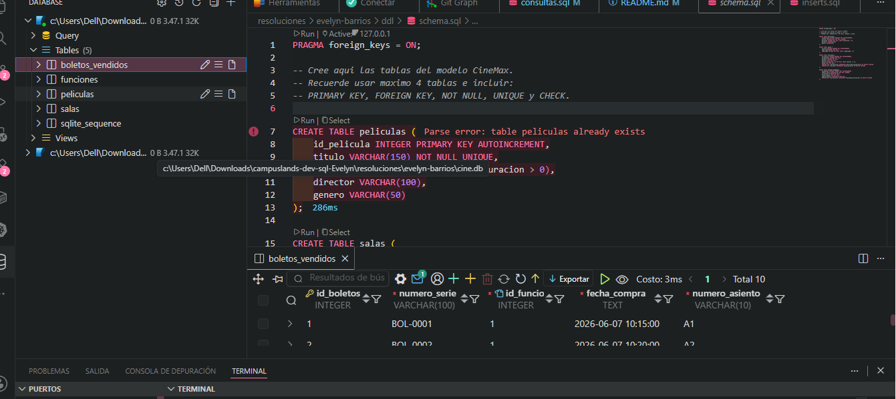
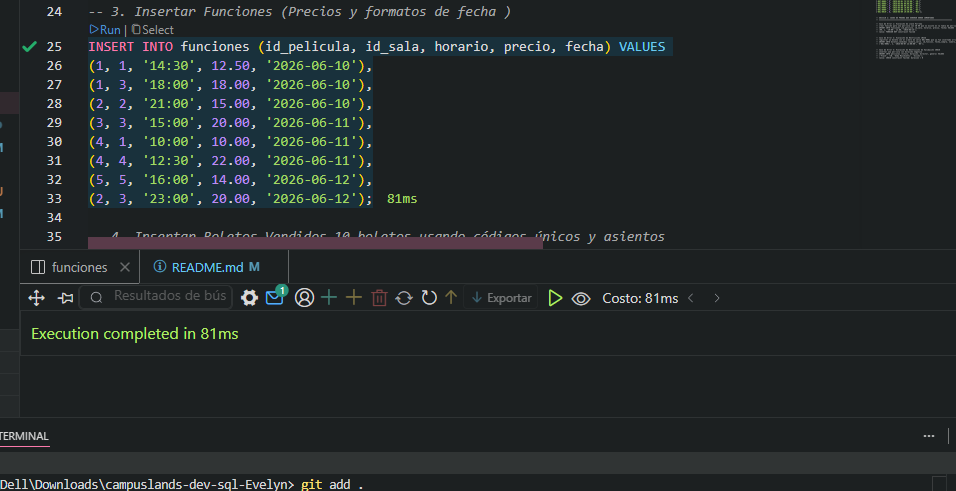
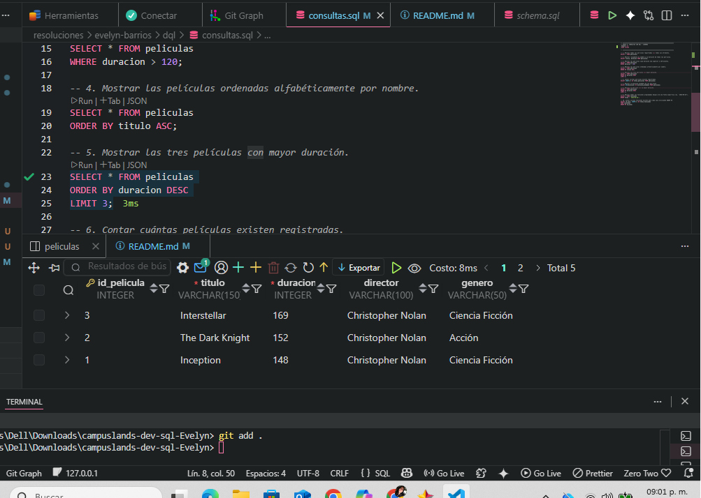
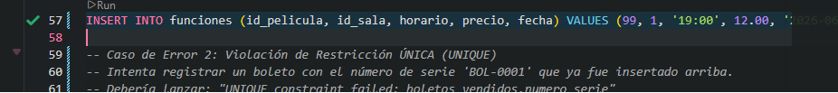
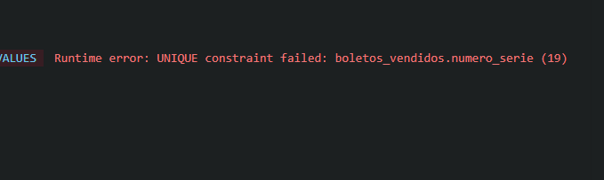

# Proyecto CineMax - Gestión de Base de Datos SQLite

## 1. Información General

- **Nombre del proyecto:** Implementación de Base de Datos para CineMax.
- **Nombre del camper:** Evelyn Barrios.
- **Fecha de entrega:** 07/06/25

## 2. Descripción del Problema

La empresa **CineMax** presentaba dificultades para gestionar la información de sus películas, salas, funciones y ventas de boletos debido a que realizaba estos procesos de forma manual. Esto impedía conocer con exactitud la disponibilidad de funciones, el rendimiento de las salas y el volumen de ventas.

La base de datos propuesta resuelve esta necesidad mediante una estructura relacional que permite:
- Organizar el catálogo de películas.
- Gestionar la programación de funciones en salas específicas con precios definidos.
- Registrar de forma única cada boleto vendido para evitar duplicidad de asientos o series.
- Generar reportes y consultas rápidas sobre la operatividad del cine.

## 3. Modelo de Datos

### Diagrama E-R

### Descripción de las Entidades
1.  **Películas:** Almacena la información técnica de los filmes (título, duración, director y género).
2.  **Salas:** Registra los espacios físicos disponibles, su tipo (2D, IMAX, VIP, etc.) y su capacidad máxima.
3.  **Funciones:** Es la entidad relacional que conecta una película con una sala en una fecha y horario específicos, asignando un precio de entrada.
4.  **Boletos Vendidos:** Registra cada venta individual, vinculándola a una función y especificando el número de serie único y el asiento asignado.

### Relaciones
- **Película - Funciones:** Una película puede proyectarse en muchas funciones (1:N).
- **Sala - Funciones:** Una sala puede albergar múltiples funciones a lo largo del tiempo (1:N).
- **Función - Boletos:** Una función específica puede generar múltiples ventas de boletos (1:N).

## 4. Restricciones Implementadas

Para garantizar la integridad de la información, se aplicaron las siguientes reglas en `schema.sql`:

-   **PRIMARY KEY:** Todas las tablas cuentan con un identificador único numérico autoincremental.
-   **FOREIGN KEY:** Se establecieron relaciones con integridad referencial y eliminación en cascada (`ON DELETE CASCADE`) para mantener la consistencia entre funciones y boletos.
-   **NOT NULL:** Campos críticos como títulos, precios, horarios y números de serie no permiten valores nulos.
-   **UNIQUE:** 
    - El título de la película es único para evitar registros duplicados.
    - El número de serie de los boletos es único para prevenir fraude o errores de facturación.
-   **CHECK:** 
    - `duracion > 0`: Asegura que no existan películas con tiempo inválido.
    - `capacidad > 0`: Garantiza que las salas tengan un aforo real.
    - `precio >= 0`: Evita el registro de precios negativos en las funciones.

## 5. Evidencias

### Creación de Tablas (DDL)

### Inserción de Registros (DML)

### Ejecución de Consultas (DQL)
A continuación se muestra la salida de las 10 consultas solicitadas por el negocio:

### Ejemplos de Errores por Restricciones
Se realizaron pruebas de estrés para validar que la base de datos rechaza datos incorrectos:

1. **Violación de Llave Foránea:** Intento de insertar una función para una película que no existe.
   - *Resultado:* `Runtime error: FOREIGN KEY constraint failed`
   - > 

2. **Violación de UNIQUE:** Intento de registrar un boleto con un número de serie ya existente.
   - *Resultado:* `Runtime error: UNIQUE constraint failed: boletos_vendidos.numero_serie`
   - 

3. **Violación de CHECK:** Intento de registrar una película con duración de -10 minutos.
   - *Resultado:* `Runtime error: CHECK constraint failed: 

---
**Nota:** Para ejecutar este proyecto, asegúrese de tener instalado SQLite3 y ejecute los scripts en el orden: `schema.sql` -> `inserts.sql` -> `consultas.sql`.  // 