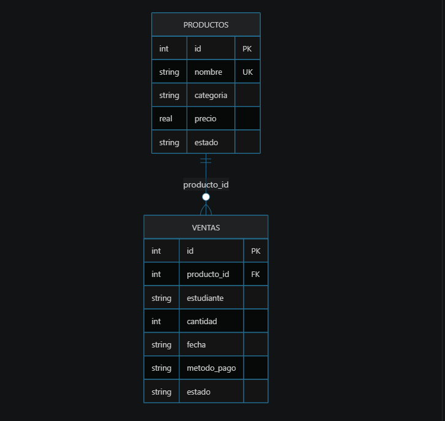

# Ejercicio 001: Cafeteria Campus

## Dificultad

Nivel 1 - comprension inicial

## Tema

Comprension de una solicitud escrita por un cliente y transformacion a modelo relacional SQL.

## Contexto del cliente

Una cafeteria cerca del campus quiere controlar productos, ventas rapidas y pagos de estudiantes.
La base de datos controla productos y ventas de estudiantes.
Cada venta registra el producto, cantidad, pago y estado.

## Archivos

- `analisis/requerimiento.md`: modelo y supuestos.
- `ddl/schema.sql`: tablas y restricciones.
- `dml/inserts.sql`: datos iniciales.
- `dml/operaciones.sql`: mantenimiento controlado.
- `dql/consultas.sql`: consultas del negocio.
- `evidencias/resultados.md`: validacion de resultados.

## Diagrama Entidad-Relación (ER)

