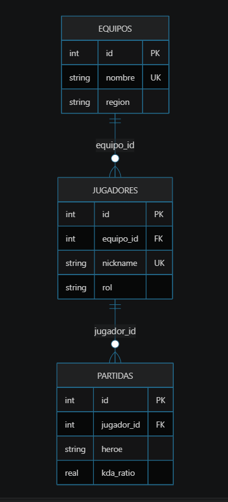

# Ejercicio 097: Liga MOBA

## Dificultad

Nivel 5 - solicitud profesional

## Tema

Comprension de una solicitud escrita por un cliente y transformacion a modelo relacional SQL.

## Contexto del cliente

Una liga profesional de videojuegos MOBA registra equipos, jugadores y partidas.

## Archivos

- `analisis/requerimiento.md`: modelo y supuestos.
- `ddl/schema.sql`: tablas y restricciones.
- `dml/inserts.sql`: datos iniciales.
- `dml/operaciones.sql`: mantenimiento controlado.

