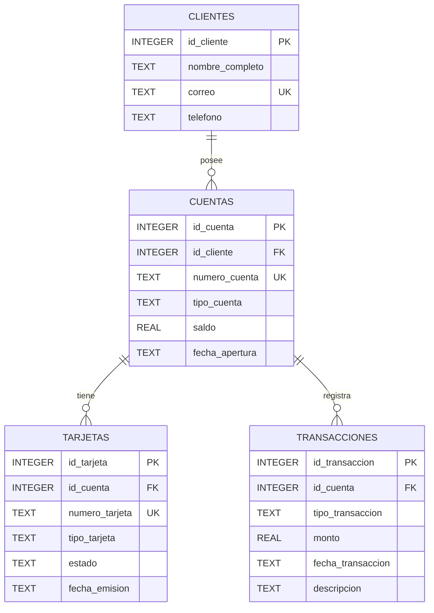

# Diagrama ER

## Relaciones

- Un cliente puede poseer una o varias cuentas.
- Una cuenta pertenece a un cliente.
- Una cuenta puede tener una o varias tarjetas.
- Una tarjeta pertenece a una cuenta.
- Una cuenta puede registrar múltiples transacciones.
- Cada transacción pertenece a una cuenta.