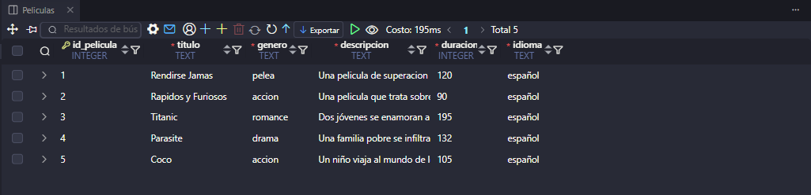
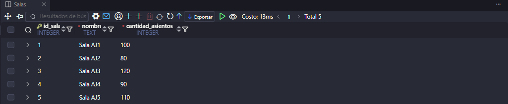
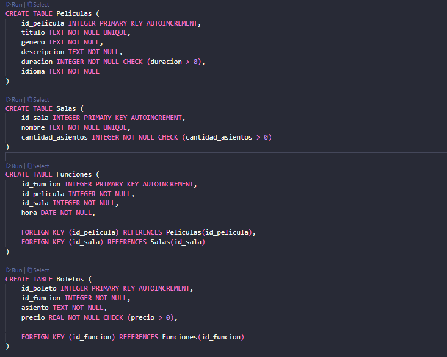
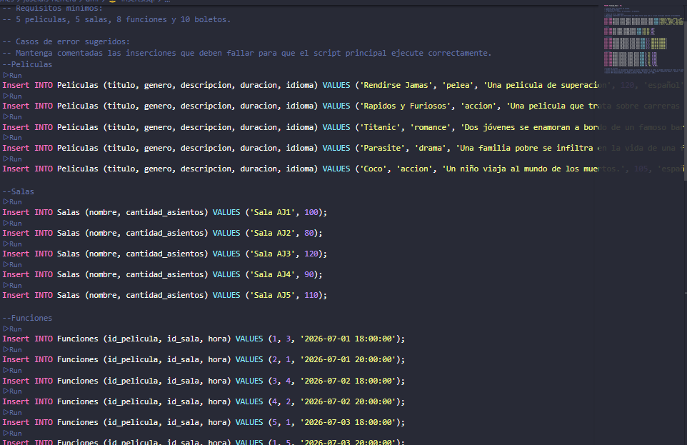
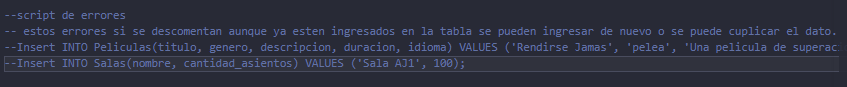
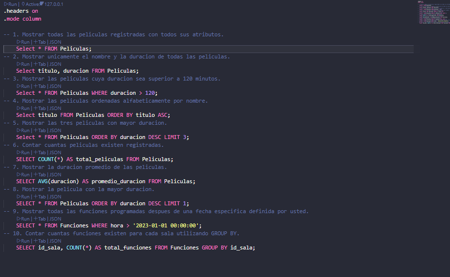

# Proyecto CineMax
**Nombre del Camper:** Jose Luis Tot Herrera
**Fecha de Entrega:** 4/06/2026

---

# **¿Cómo ayuda la base de datos propuesta?**
Ayuda a centralizar y organizar la información de películas, salas, funciones y boletos en un sistema relacional confiable. Esto permite realizar consultas rápidas, automatizar reportes de ventas y controlar la disponibilidad de asientos en tiempo real de forma segura.

---

## Modelo de Datos
* **Diagrama Entidad-Relación (UML E-R):**
  

* **Descripción de las Entidades:**
  1. `Peliculas`: Almacena la información de las películas (título, duración, género...).
  2. `Salas`: Almacena los datos de los espacios físicos de proyección (nombre y capacidad).
  3. `Funciones`: Entidad intermedia que conecta una película con una sala en una fecha y hora específica.
  4. `Boletos`: Registra cada ticket vendido para una función concreta, asignando un asiento y precio.

---

## Restricciones Implementadas
Para asegurar la integridad de la base de datos se aplicaron las siguientes reglas de negocio obligatorias en el DDL:
* `PRIMARY KEY`: Llaves primarias autoincrementales para identificar de forma única cada registro en las 4 tablas.
* `FOREIGN KEY`: Llaves foráneas con `PRAGMA foreign_keys = ON;` para amarrar los boletos a las funciones, y las funciones a las películas y salas.
* `NOT NULL`: Aplicado en campos críticos (como títulos, capacidades, asientos y precios) para evitar registros vacíos o incompletos.
* `UNIQUE`: Restricción para garantizar que no existan dos películas con el mismo título ni dos salas con el mismo nombre.
* `CHECK`: Validaciones lógicas para impedir que la duración de una película, la capacidad de una sala o el precio de un boleto sean menores o iguales a cero.

---

## Evidencias de Ejecución

### Creación de las Tablas (DDL)

### Inserción de Registros (DML).

### Ejemplos de Errores por Restricciones

###  Ejecución de Consultas (DQL)
