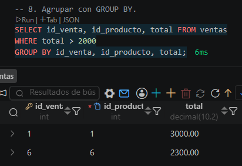

## EJERCICIO 02 Campus_Shop

## Descripción 
Este ejercicio se ha utilizado consultas básicas para la consultas en base de datos, cada uno de los ejercicios ha sido rigurosamente ejecutado de manera coherente y con criterio propio.

## Ejemplos
```sql
-- 7. Calcular promedio, minimo o maximo.
SELECT AVG(total) FROM ventas;

SELECT MIN(precio) AS precio_minimo, MAX(precio) AS precio_maximo
FROM productos;

-- 8. Agrupar con GROUP BY.
SELECT id_venta, id_producto, total FROM ventas
WHERE total > 2000
GROUP BY id_venta, id_producto, total;

```
# EVIDENCIAS
