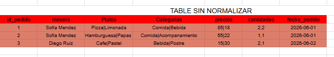
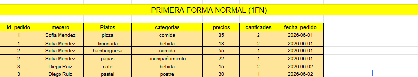
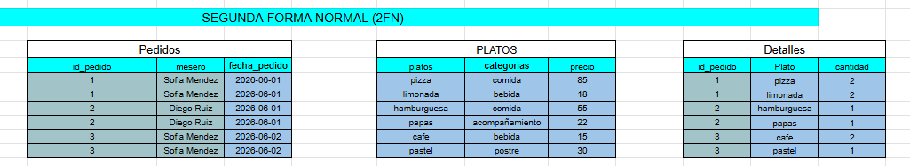
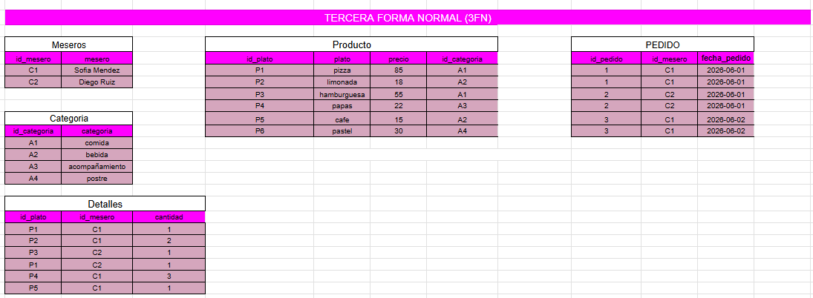

# Analisis de Normalizacion - Ejercicio 32

## Tabla original

Describa la tabla sin normalizar del archivo `datos/datos-sin-normalizar.csv`.


## Problemas detectados

- Grupos repetidos:si
- Datos duplicados:si
- Dependencias parciales: si
- Dependencias transitivas: no
- Anomalias de insercion: si
- Anomalias de actualizacion: si
- Anomalias de eliminacion: si

## Dependencias funcionales

Escriba las dependencias funcionales principales.

```text
A -> B
A, B -> C
```

## Primera Forma Normal (1FN)

Explique que cambios hizo para eliminar grupos repetidos y valores multiples.


## Segunda Forma Normal (2FN)

Explique que dependencias parciales elimino.


## Tercera Forma Normal (3FN)

Explique que dependencias transitivas elimino.


## Modelo final

Liste cada tabla final, su llave primaria y sus llaves foraneas.

| Tabla | Llave primaria | Llaves foraneas | Proposito |
| --- | --- | --- | --- |
| | | | |

## Justificacion

Explique por que el modelo final reduce duplicidad y evita anomalias.
